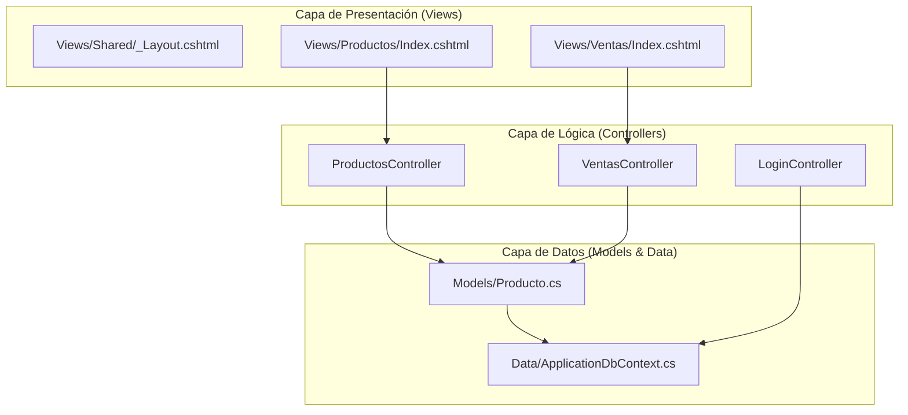
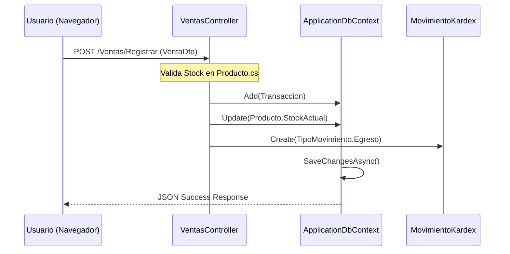

# Visión General del Proyecto

# Visión General del Proyecto

Relevant source files

The following files were used as context for generating this wiki page:

- [.devin/wiki.json](.devin/wiki.json)
- [InventarioApp.csproj](InventarioApp.csproj)
- [InventarioAppASP.sln](InventarioAppASP.sln)
- [README.md](README.md)
- [readme.txt](readme.txt)

El sistema **InventarioApp** es una solución integral de gestión empresarial desarrollada bajo un enfoque universitario para el control de inventarios, procesos de compra-venta y administración de usuarios. El sistema permite la trazabilidad completa de productos desde su ingreso al almacén hasta su salida por venta o ajuste manual, integrando un esquema de seguridad basado en roles y permisos.

## Propósito y Alcance

El propósito principal del proyecto es proporcionar una herramienta robusta para la administración de catálogos (productos, categorías, impuestos) y el registro transaccional de movimientos de stock. El sistema no solo gestiona la existencia física de los artículos, sino que también automatiza el cálculo de impuestos, la generación de registros de auditoría y la gestión de cuentas por cobrar o pagar.

### Capacidades Principales
- **Gestión de Inventario:** Control de existencias con alertas de stock bajo [README.md:120-120]().
- **Procesamiento de Transacciones:** Registro de compras y ventas con actualización automática del Kárdex [README.md:121-122]().
- **Seguridad RBAC:** Control de acceso basado en permisos específicos para cada acción del sistema.
- **Auditoría:** Registro automático de cambios en el sistema para trazabilidad.

## Tecnologías Principales

El proyecto utiliza una pila tecnológica moderna basada en el ecosistema de .NET y herramientas web estándar:

| Capa | Tecnologías |
| :--- | :--- |
| **Framework Backend** | ASP.NET Core 10.0 (MVC) [InventarioApp.csproj:4-4]() |
| **Persistencia** | Entity Framework Core 9.0 con Pomelo MySQL [InventarioApp.csproj:12-14]() |
| **Base de Datos** | MySQL / MariaDB [README.md:51-51]() |
| **Seguridad** | Cookie Authentication & BCrypt.Net-Next [InventarioApp.csproj:16-18]() |
| **Frontend UI** | Tailwind CSS, jQuery, Tabulator, SweetAlert2 [README.md:2-2]() |

### Mapa de Componentes del Sistema

El siguiente diagrama ilustra cómo los componentes del código se relacionan con las capas lógicas del sistema.

**Diagrama: Relación entre Espacio de Nombres y Capas**

**Sources:** [README.md:13-39](), [Data/ApplicationDbContext.cs:1-22]()

## Estructura del Repositorio

La organización del código sigue el patrón estándar de ASP.NET Core MVC, facilitando la separación de responsabilidades:

- **`Controllers/`**: Contiene la lógica de despacho de solicitudes, como `ProductosController.cs` y `VentasController.cs` [README.md:13-19]().
- **`Models/`**: Define las entidades de negocio (e.g., `Producto.cs`, `Usuario.cs`) y modelos de vista [README.md:22-26]().
- **`Data/`**: Aloja el `ApplicationDbContext.cs` que gestiona la comunicación con MySQL [README.md:20-21]().
- **`Views/`**: Contiene las plantillas Razor para la interfaz de usuario, organizadas por controlador [README.md:29-37]().
- **`Program.cs`**: Punto de entrada de la aplicación y configuración de servicios [README.md:39-39]().

### Flujo de Datos Transaccional

Este diagrama muestra cómo una acción de usuario (como registrar una venta) fluye a través de las entidades del código.

**Diagrama: Flujo de una Venta en el Código**

**Sources:** [README.md:122-122](), [Controllers/VentasController.cs:1-100](), [Models/Compra.cs:1-50]()

## Navegación de la Wiki

Para comprender en profundidad el funcionamiento del sistema, se recomienda seguir el orden de las páginas hijas:

1.  **[Configuración del Entorno y Puesta en Marcha](#1.1)**: Detalles sobre cómo preparar el entorno local, configurar la cadena de conexión en `appsettings.json` y ejecutar el script `database.sql` [README.md:58-95]().
2.  **[Arquitectura General de la Aplicación](#1.2)**: Análisis del flujo de ejecución, el uso de filtros globales y la integración entre el backend y los componentes frontend como **Tabulator** [README.md:126-148]().

---
**Sources:** [README.md:1-183](), [InventarioApp.csproj:1-21](), [.devin/wiki.json:1-7]()

---

