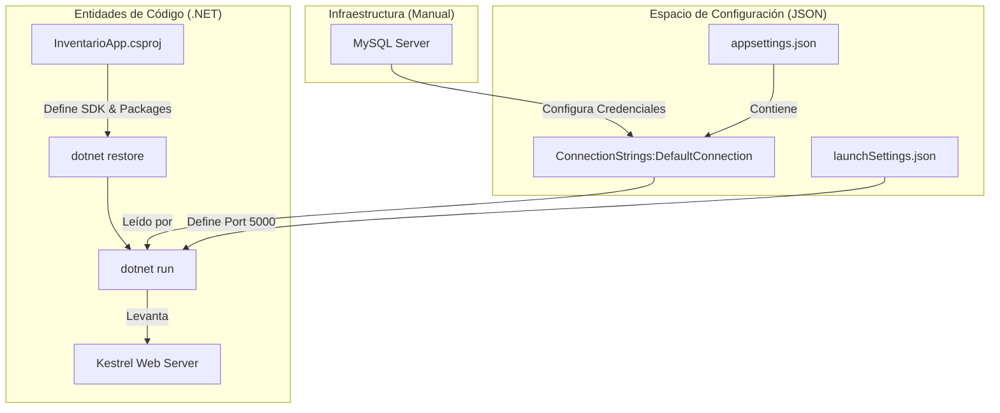
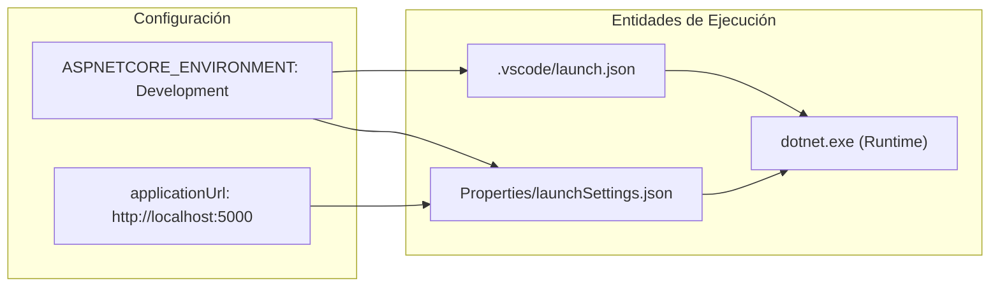

# Configuración del Entorno y Puesta en Marcha


# Configuración del Entorno y Puesta en Marcha

<details>
<summary>Relevant source files</summary>

The following files were used as context for generating this wiki page:

- [.vscode/launch.json](.vscode/launch.json)
- [.vscode/tasks.json](.vscode/tasks.json)
- [InventarioApp.csproj](InventarioApp.csproj)
- [Properties/launchSettings.json](Properties/launchSettings.json)
- [appsettings.json](appsettings.json)
- [readme.txt](readme.txt)

</details>


Esta página proporciona las instrucciones técnicas necesarias para preparar el entorno de desarrollo, configurar la persistencia de datos y ejecutar la aplicación **InventarioApp**. El sistema está construido sobre el ecosistema .NET y utiliza MySQL como motor de base de datos relacional.

## Requisitos Previos

Antes de comenzar, asegúrese de tener instalados los siguientes componentes:

1.  **SDK de .NET**: El proyecto está configurado para `net8.0` o superior [InventarioApp.csproj:4-4]().
2.  **MySQL Server**: Se requiere una instancia de MySQL o MariaDB accesible localmente.
3.  **Herramientas de CLI**: `dotnet-ef` para la gestión de migraciones de Entity Framework Core.

## Configuración de Dependencias

El proyecto utiliza varios paquetes NuGet críticos para su funcionamiento, incluyendo el proveedor de base de datos Pomelo para MySQL y BCrypt para la seguridad de credenciales.

| Paquete | Versión | Propósito |
| :--- | :--- | :--- |
| `Pomelo.EntityFrameworkCore.MySql` | 9.0.0 | Driver para conexión con MySQL [InventarioApp.csproj:14-14](). |
| `Microsoft.EntityFrameworkCore.Tools` | 9.0.0 | Herramientas para migraciones y actualización de DB [InventarioApp.csproj:13-13](). |
| `BCrypt.Net-Next` | 4.0.3 | Hashing de contraseñas de usuarios [InventarioApp.csproj:18-18](). |
| `Microsoft.AspNetCore.Authentication.Cookies` | 2.2.0 | Middleware de autenticación basado en cookies [InventarioApp.csproj:16-16](). |

Para instalar las dependencias, ejecute:
```bash
dotnet restore
```
*Sources: [InventarioApp.csproj:10-19](), [readme.txt:5-6]()*

## Configuración de la Base de Datos

La conexión se define en el archivo de configuración global. Por defecto, el sistema busca una base de datos llamada `inventario` en `localhost`.

### Ajuste de appsettings.json
Debe modificar la cadena de conexión `DefaultConnection` para que coincida con sus credenciales de MySQL:

```json
"ConnectionStrings": {
  "DefaultConnection": "server=localhost;database=inventario;user=tu_usuario;password=tu_password;"
}
```
*Sources: [appsettings.json:2-5]()*

### Inicialización del Esquema
Una vez configurada la cadena de conexión, utilice Entity Framework Core para crear las tablas:

1.  **Crear Migración**: `dotnet ef migrations add InitialCreate`
2.  **Actualizar Base de Datos**: `dotnet ef database update`

## Ejecución de la Aplicación

Existen múltiples formas de poner en marcha el servidor de desarrollo Kestrel.

### Usando dotnet CLI
Desde la raíz del proyecto, puede utilizar los siguientes comandos:

*   **Ejecución estándar**: `dotnet run` [readme.txt:1-2]().
*   **Modo Observador (Hot Reload)**: `dotnet watch run` [ .vscode/tasks.json:15-15]().

La aplicación estará disponible por defecto en `http://localhost:5000` [Properties/launchSettings.json:8-8]().

### Configuración en VS Code
El repositorio incluye archivos de configuración para Visual Studio Code que facilitan la depuración:

*   **Launch Task**: Configurada para iniciar el navegador automáticamente al detectar el patrón "Now listening on" [.vscode/launch.json:13-16]().
*   **Build Task**: Ejecuta `dotnet build` antes de cada lanzamiento [.vscode/tasks.json:5-10]().

### Diagrama de Flujo de Puesta en Marcha

El siguiente diagrama ilustra la transición desde la configuración de infraestructura hasta la entidad de ejecución en el código.

Title: Flujo de Inicialización del Sistema

*Sources: [appsettings.json:2-5](), [InventarioApp.csproj:1-21](), [Properties/launchSettings.json:3-14](), [readme.txt:1-6]()*

## Variables de Entorno y Perfiles

La aplicación utiliza perfiles de lanzamiento para diferenciar entornos. En desarrollo, la variable `ASPNETCORE_ENVIRONMENT` se establece como `Development` [.vscode/launch.json:18-19](), lo que permite ver errores detallados y registros de información en la consola [appsettings.json:8-8]().

Title: Asociación de Configuración a Entidades de Ejecución

*Sources: [.vscode/launch.json:1-21](), [Properties/launchSettings.json:1-15]()*

---

