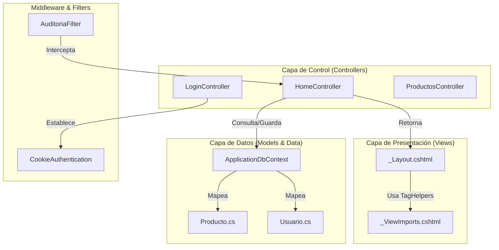
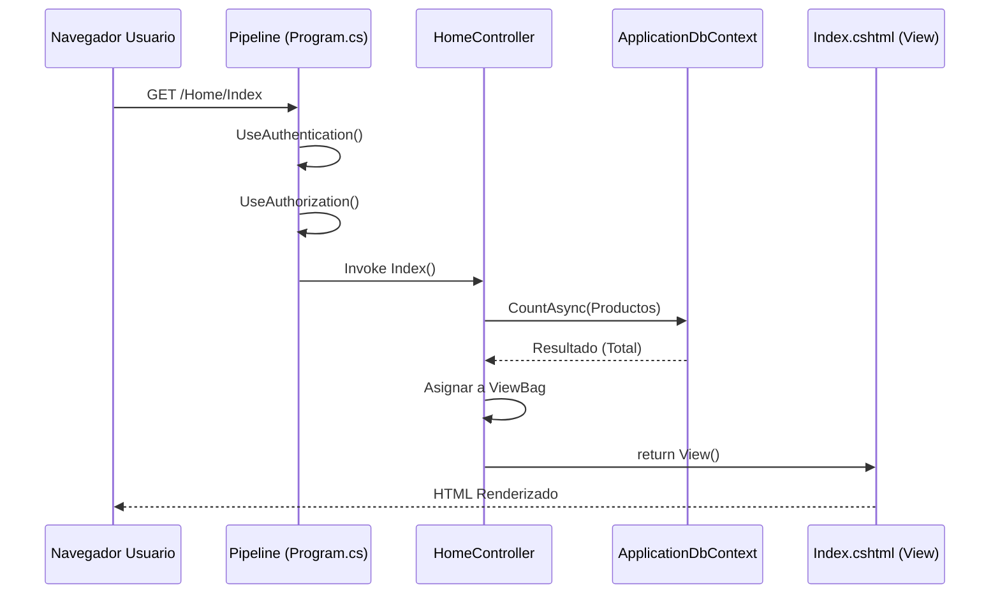

# Arquitectura General de la Aplicación

# Arquitectura General de la Aplicación

Relevant source files

The following files were used as context for generating this wiki page:

- [Controllers/HomeController.cs](Controllers/HomeController.cs)
- [Program.cs](Program.cs)
- [Views/Shared/_Layout.cshtml](Views/Shared/_Layout.cshtml)
- [Views/Shared/_ValidationScriptsPartial.cshtml](Views/Shared/_ValidationScriptsPartial.cshtml)
- [Views/_ViewImports.cshtml](Views/_ViewImports.cshtml)
- [Views/_ViewStart.cshtml](Views/_ViewStart.cshtml)

Esta sección describe la infraestructura técnica de **InventarioApp**, detallando la implementación del patrón **Model-View-Controller (MVC)**, el ciclo de vida de las solicitudes y la integración de componentes transversales como filtros de auditoría y seguridad.

## Estructura del Patrón MVC

La aplicación utiliza el patrón arquitectónico MVC de ASP.NET Core para separar las responsabilidades de datos, lógica de presentación y control de flujo.

| Componente | Responsabilidad en el Proyecto | Ubicación Principal |
| :--- | :--- | :--- |
| **Model** | Representación de entidades de base de datos y lógica de validación mediante DataAnnotations. | `Models/` |
| **View** | Interfaz de usuario dinámica procesada en el servidor mediante Razor Pages, integrada con Tailwind CSS. | `Views/` |
| **Controller** | Orquestación de la lógica de negocio, manejo de acciones del usuario y comunicación con el `ApplicationDbContext`. | `Controllers/` |
| **Data** | Capa de persistencia que utiliza Entity Framework Core para el mapeo objeto-relacional (ORM). | `Data/` |

### Diagrama de Entidades de Código y Flujo MVC
Este diagrama vincula los componentes lógicos con las clases y archivos específicos que implementan la arquitectura.

**Sources:** [Program.cs:29-32](), [Views/_ViewStart.cshtml:1-3](), [Views/_ViewImports.cshtml:1-5](), [Controllers/HomeController.cs:13-16]()

---

## Flujo de una Solicitud HTTP

El ciclo de vida de una petición en InventarioApp sigue un pipeline configurado en el `Program.cs`, procesando la seguridad y la auditoría antes de llegar a la lógica de negocio.

1.  **Enrutamiento:** El middleware de enrutamiento asocia la URL con un controlador y una acción. La ruta por defecto está configurada para dirigir al `LoginController` [Program.cs:58-60]().
2.  **Autenticación y Autorización:** Se verifica la identidad mediante cookies. Si el usuario no está autenticado, el pipeline lo redirige a `/Login` [Program.cs:15-23]().
3.  **Filtros de Acción:** Antes de ejecutar la acción del controlador, el `AuditoriaFilter` intercepta la solicitud para registrar cambios si se trata de operaciones de escritura (POST/PUT/DELETE) [Program.cs:25-32]().
4.  **Ejecución del Controlador:** El controlador interactúa con el `ApplicationDbContext` para obtener o modificar datos [Controllers/HomeController.cs:18-26]().
5.  **Renderizado de Vista:** Se combina el modelo de datos con la vista Razor. El archivo `_ViewStart.cshtml` asegura que todas las vistas utilicen `_Layout.cshtml` como plantilla base [Views/_ViewStart.cshtml:1-3]().

### Diagrama de Secuencia: Solicitud de Datos
El siguiente diagrama muestra el flujo desde que el usuario solicita el Dashboard hasta que se renderiza la información.

**Sources:** [Program.cs:50-55](), [Controllers/HomeController.cs:18-26](), [Views/Shared/_Layout.cshtml:193-196]()

---

## Componentes Principales y su Interacción

### 1. El Middleware y el Pipeline
La aplicación configura un pipeline de procesamiento de solicitudes que incluye soporte para sesiones (usado principalmente en el carrito del POS) y archivos estáticos [Program.cs:51-53]().

### 2. Capa de Datos (EF Core)
El `ApplicationDbContext` actúa como la unidad de trabajo. Se inyecta en los controladores mediante Inyección de Dependencias (DI) [Controllers/HomeController.cs:15-16](). La conexión se gestiona con MySQL a través de `Pomelo.EntityFrameworkCore.MySql` [Program.cs:11-13]().

### 3. Filtros Globales (Auditoría)
A diferencia de aplicaciones estándar, InventarioApp registra automáticamente las acciones del usuario. El `AuditoriaFilter` está registrado globalmente en el contenedor de servicios MVC, lo que garantiza que ninguna operación de modificación de datos pase desapercibida [Program.cs:25-32]().

### 4. Interfaz de Usuario Compartida
El archivo `_Layout.cshtml` centraliza las dependencias de frontend y la estructura visual:
*   **Librerías:** Tailwind CSS, Tabulator (tablas), SweetAlert2 (diálogos) y iziToast (notificaciones) [Views/Shared/_Layout.cshtml:8-17]().
*   **Seguridad en UI:** El menú lateral se renderiza condicionalmente verificando si el usuario está autenticado [Views/Shared/_Layout.cshtml:193-195]().
*   **Validación:** Se utiliza `_ValidationScriptsPartial.cshtml` para integrar validación en el lado del cliente mediante jQuery Validate [Views/Shared/_ValidationScriptsPartial.cshtml:1-3]().

### 5. Gestión de Sesión
Se ha configurado un tiempo de espera de 30 minutos para la sesión, la cual es fundamental para mantener el estado temporal durante la generación de ventas o compras antes de persistirlas en la base de datos [Program.cs:34-39]().

**Sources:** [Program.cs:10-40](), [Views/Shared/_Layout.cshtml:1-20](), [Controllers/HomeController.cs:1-33]()

---

