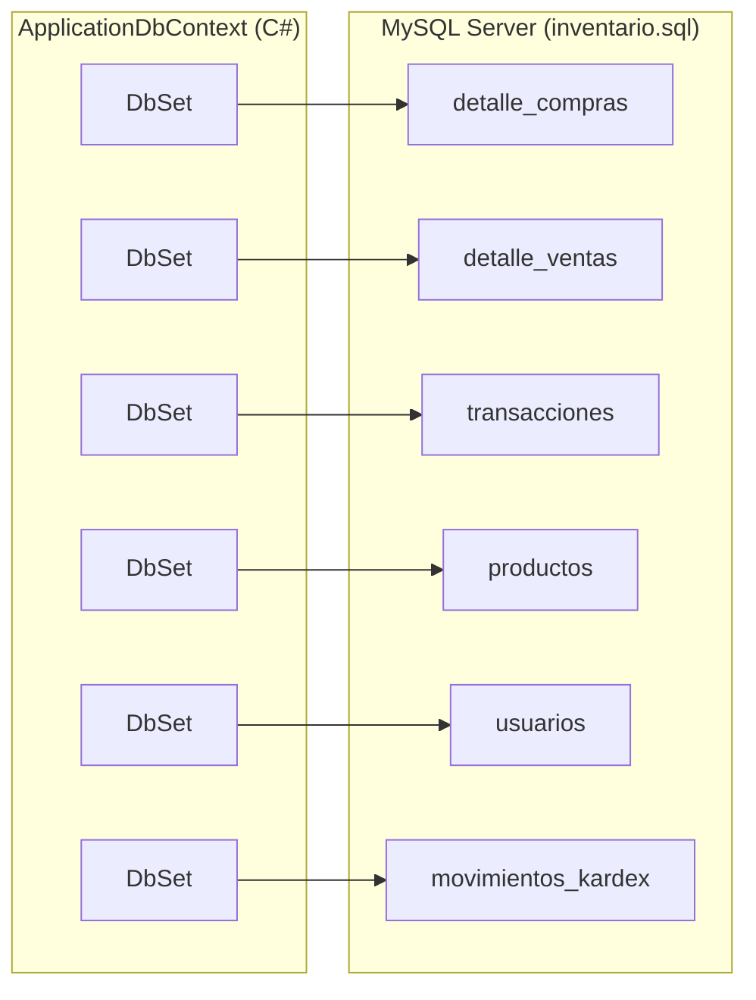
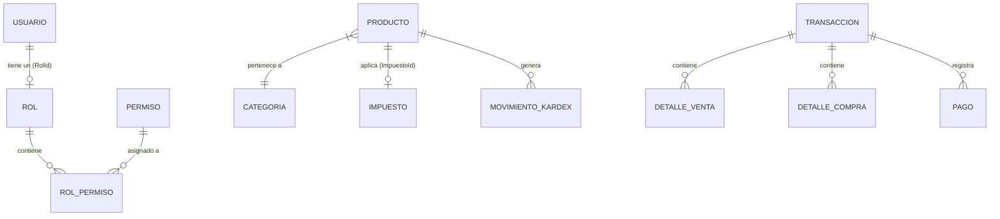

# Capa de Datos y Esquema de Base de Datos

# Capa de Datos y Esquema de Base de Datos

Relevant source files

The following files were used as context for generating this wiki page:

- [Data/ApplicationDbContext.cs](Data/ApplicationDbContext.cs)
- [inventario.sql](inventario.sql)

Esta sección describe la arquitectura de persistencia de **InventarioApp**, la cual utiliza **Entity Framework Core** como ORM para interactuar con un motor de base de datos **MySQL**. El sistema emplea un enfoque de acceso a datos centralizado mediante un `DbContext` que gestiona catálogos, inventarios, transacciones financieras y el control de acceso basado en roles (RBAC).

## Visión General de la Persistencia

La aplicación se apoya en `ApplicationDbContext` para mapear las clases de dominio de C# a tablas relacionales. La configuración se realiza mediante una combinación de **Data Annotations** en los modelos y **Fluent API** en el contexto para relaciones complejas y restricciones de integridad referencial.

### Mapa de Entidades de Código a Base de Datos

El siguiente diagrama asocia los `DbSet` definidos en el código con las tablas físicas generadas en el servidor MySQL.

**Diagrama: Mapeo de Code-Entities a Tablas SQL**

**Sources:** [Data/ApplicationDbContext.cs:18-36](), [inventario.sql:83-117]()

## Estructura del Esquema y Relaciones

El esquema de la base de datos está normalizado para garantizar la integridad de las transacciones comerciales. Las relaciones clave incluyen:

1.  **Jerarquía de Catálogo:** Los productos pertenecen a categorías y tienen impuestos asociados [inventario.sql:155-177]().
2.  **Ciclo Transaccional:** Una `Transaccion` actúa como cabecera unificada para compras y ventas, vinculándose a múltiples detalles y registros de pagos [Data/ApplicationDbContext.cs:95-114]().
3.  **Trazabilidad de Inventario:** Cada cambio en el stock de un producto genera un registro en la tabla `movimientos_kardex` [inventario.sql:138-153]().

### Diagrama de Relaciones de Entidades (ERD)

Este diagrama refleja las relaciones definidas mediante Fluent API en el `ApplicationDbContext`.

**Diagrama: Relaciones de Dominio en ApplicationDbContext**

**Sources:** [Data/ApplicationDbContext.cs:54-115](), [inventario.sql:18-29]()

## Componentes de la Capa de Datos

La lógica de datos se divide en cuatro áreas principales, detalladas en las páginas hijas:

### 2.1 [ApplicationDbContext y Configuración de EF Core](#2.1)
Describe la implementación de `ApplicationDbContext`. Incluye la configuración de índices únicos para `UserName` y `Correo`, y la conversión de enumeraciones (como `TipoTransaccion`) a strings para almacenamiento en base de datos.
*   **Referencia de Código:** [Data/ApplicationDbContext.cs:38-83]()

### 2.2 [Modelos de Dominio: Catálogo e Inventario](#2.2)
Detalla las entidades `Producto`, `Categoria` e `Impuesto`. Explica cómo se gestionan las restricciones de eliminación (`OnDelete(DeleteBehavior.Restrict)`) para evitar la pérdida de integridad referencial al intentar borrar categorías con productos activos.
*   **Referencia de Código:** [Data/ApplicationDbContext.cs:54-65]()

### 2.3 [Modelos de Dominio: Transacciones, Pagos y Kárdex](#2.3)
Cubre la lógica de persistencia para el flujo financiero. Explica la relación `Cascade` entre una transacción y sus detalles/pagos, asegurando que al eliminar una factura se limpien sus registros asociados.
*   **Referencia de Código:** [Data/ApplicationDbContext.cs:95-114]()

### 2.4 [Modelos de Identidad: Usuario, Rol y Permiso](#2.4)
Explica el esquema de Seguridad (RBAC). Detalla la tabla de unión `RolPermisos` que utiliza una llave primaria compuesta para gestionar los privilegios de acceso de forma granular.
*   **Referencia de Código:** [Data/ApplicationDbContext.cs:85-93]()

---

