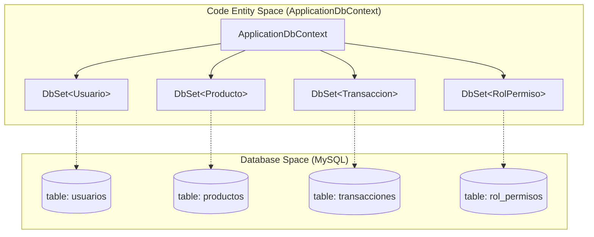
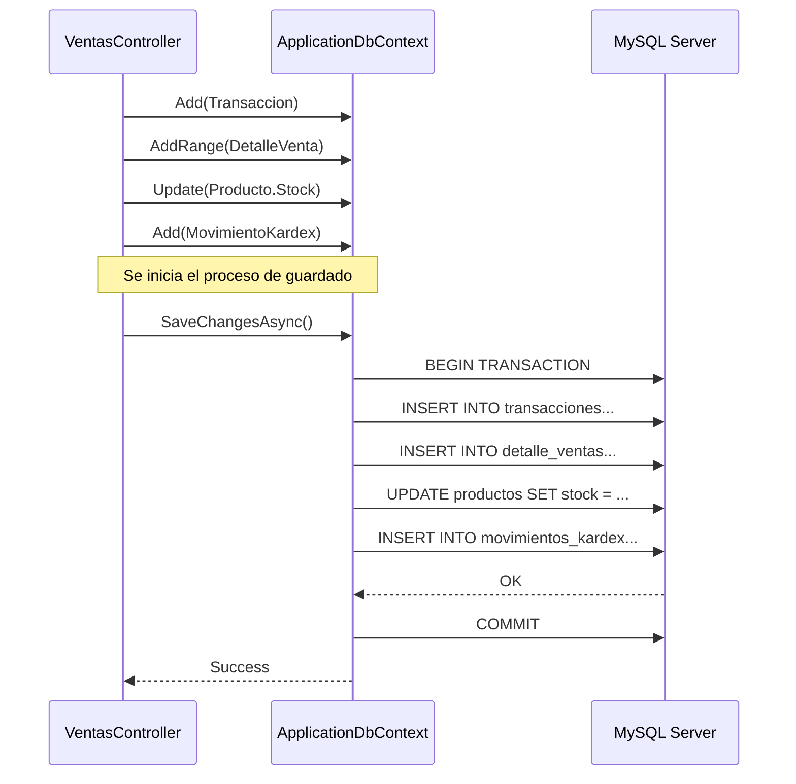

# ApplicationDbContext y Configuración de EF Core

# ApplicationDbContext y Configuración de EF Core

Relevant source files

The following files were used as context for generating this wiki page:

- [Data/ApplicationDbContext.cs](Data/ApplicationDbContext.cs)
- [inventario.sql](inventario.sql)

El `ApplicationDbContext` es el componente central de la capa de persistencia en **InventarioApp**. Actúa como el puente entre los modelos de dominio definidos en C# y la base de datos MySQL, gestionando el ciclo de vida de las entidades, el rastreo de cambios y la traducción de consultas LINQ a SQL.

## Estructura del Contexto y DbSets

La clase `ApplicationDbContext` hereda de `DbContext` y expone múltiples `DbSet<T>` que representan las tablas de la base de datos. Estos se agrupan lógicamente en cuatro categorías: Catálogos, Seguridad, Transacciones y Operaciones ERP.

| Categoría | Propiedades DbSet | Entidad Relacionada |
| :--- | :--- | :--- |
| **Catálogos** | `Usuarios`, `Categorias`, `Productos`, `Impuestos` | [Data/ApplicationDbContext.cs:18-21]() |
| **Seguridad** | `Roles`, `Permisos`, `RolPermisos` | [Data/ApplicationDbContext.cs:24-26]() |
| **Transacciones** | `Transacciones`, `DetalleCompras`, `DetalleVentas` | [Data/ApplicationDbContext.cs:29-31]() |
| **ERP y Auditoría** | `MovimientosKardex`, `Pagos`, `AuditoriaLogs` | [Data/ApplicationDbContext.cs:34-36]() |

### Diagrama: Mapeo de Code Entities a Base de Datos

El siguiente diagrama muestra cómo las definiciones en `ApplicationDbContext` se proyectan hacia el esquema físico en el servidor MySQL (definido en `inventario.sql`).

**Context to Schema Mapping**

**Sources:** [Data/ApplicationDbContext.cs:12-37](), [inventario.sql:18-132]()

---

## Configuración Fluent API

El método `OnModelCreating` se utiliza para definir configuraciones avanzadas que no pueden expresarse mediante Data Annotations. Esto incluye restricciones de integridad referencial, índices únicos y conversiones de tipos de datos.

### Índices Únicos y Claves
Se aplican restricciones de unicidad para garantizar la integridad de los datos de identidad:
*   **Correo de Usuario:** Se establece un índice único en `u.Correo` [Data/ApplicationDbContext.cs:43-45]().
*   **Nombre de Usuario:** Se define el índice único `uk_usuarios_username` en `u.UserName` [Data/ApplicationDbContext.cs:48-51]().
*   **Clave Compuesta:** La entidad `RolPermiso` utiliza una clave primaria compuesta por `RolId` y `PermisoId` [Data/ApplicationDbContext.cs:92-93]().

### Comportamiento de Eliminación (Delete Behaviors)
El sistema define explícitamente qué sucede con los registros relacionados cuando se elimina una entidad padre:

*   **Restrict:** No se permite eliminar una `Categoria` si tiene `Productos` asociados [Data/ApplicationDbContext.cs:54-58]().
*   **SetNull:** Si se elimina un `Rol` o un `Impuesto`, las referencias en `Usuario` o `Producto` se establecen en `NULL` en lugar de borrar el registro hijo [Data/ApplicationDbContext.cs:61-65](), [Data/ApplicationDbContext.cs:85-89]().
*   **Cascade:** Al eliminar una `Transaccion`, se eliminan automáticamente sus `DetalleCompra`, `DetalleVenta` y `Pagos` asociados [Data/ApplicationDbContext.cs:96-114]().

### Conversión de Enums a String
Para facilitar la legibilidad en la base de datos (evitando el almacenamiento de enteros poco descriptivos), los enumerados se mapean como cadenas de texto con una longitud máxima de 15 caracteres:
*   `Transaccion.Tipo` y `Transaccion.EstadoPago` [Data/ApplicationDbContext.cs:68-76]().
*   `MovimientoKardex.Tipo` [Data/ApplicationDbContext.cs:79-82]().

---

## Estrategia de Persistencia y Flujo de Datos

La aplicación utiliza una estrategia de persistencia directa donde el `ApplicationDbContext` es inyectado en los controladores para realizar operaciones CRUD y transacciones complejas.

### Diagrama de Flujo: Persistencia de Transacción
Este diagrama ilustra cómo el contexto coordina la persistencia de una venta, afectando múltiples tablas bajo una misma unidad de trabajo.

**Transaction Persistence Flow**

**Sources:** [Data/ApplicationDbContext.cs:29-35](), [inventario.sql:104-117](), [inventario.sql:228-245]()

### Resumen de Restricciones en SQL
El esquema generado en `inventario.sql` refleja las configuraciones de Fluent API mediante `CONSTRAINT` y `FOREIGN KEY`. Por ejemplo, la tabla `detalle_compras` implementa la eliminación en cascada vinculada a `transacciones` [inventario.sql:95](), mientras que la relación con `productos` está restringida para evitar la pérdida de historial de costos [inventario.sql:94]().

**Sources:**
*   [Data/ApplicationDbContext.cs:1-116]()
*   [inventario.sql:17-132]()

---

