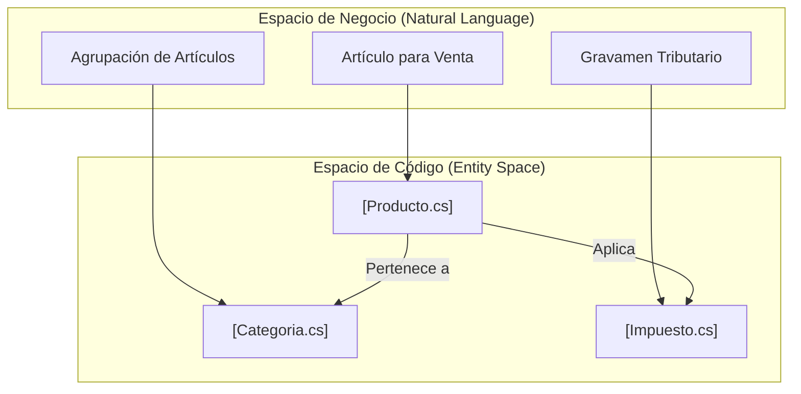
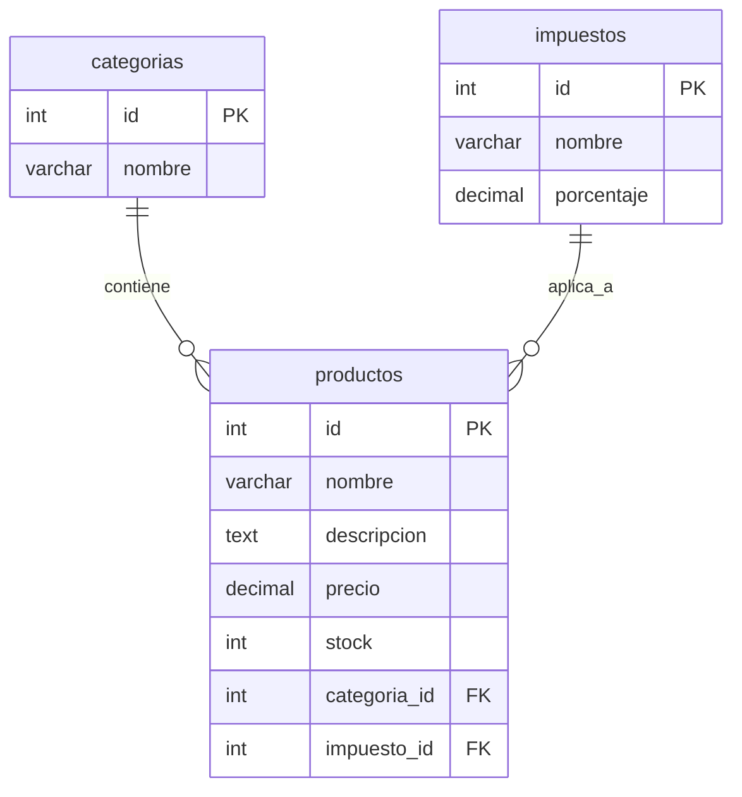

# Modelos de Dominio: Catálogo e Inventario

# Modelos de Dominio: Catálogo e Inventario

Relevant source files

The following files were used as context for generating this wiki page:

- [Controllers/ProductosController.cs](Controllers/ProductosController.cs)
- [Models/Categoria.cs](Models/Categoria.cs)
- [Models/Impuesto.cs](Models/Impuesto.cs)
- [Models/Producto.cs](Models/Producto.cs)
- [inventario.sql](inventario.sql)

Esta sección describe los modelos de datos que conforman el núcleo del catálogo de productos y la estructura de inventario en **InventarioApp**. Estos modelos definen cómo se almacenan los bienes, cómo se clasifican y cómo se aplican las normativas tributarias sobre sus precios.

## 1. Visión General de los Modelos

El sistema utiliza tres entidades principales para gestionar el catálogo: `Producto`, `Categoria` e `Impuesto`. Estas clases están decoradas con `DataAnnotations` para aplicar validaciones tanto a nivel de aplicación como en la generación del esquema de base de datos MySQL.

### Mapeo de Conceptos de Negocio a Entidades de Código

El siguiente diagrama ilustra cómo los conceptos del mundo real se traducen en clases de C# dentro del espacio de nombres `InventarioApp.Models`.

**Diagrama: Mapeo de Dominio a Código**

**Sources:** [Models/Producto.cs:1-53](), [Models/Categoria.cs:1-22](), [Models/Impuesto.cs:1-25]()

---

## 2. Modelo: Producto

La clase `Producto` representa la entidad central del sistema. Contiene información sobre precios, existencias y referencias a su categorización.

### Propiedades y Validaciones
*   **Identificación:** Utiliza una clave primaria entera autoincremental `Id` [Models/Producto.cs:12-13]().
*   **Stock:** Se valida para que nunca sea negativo mediante `[Range(0, int.MaxValue)]` [Models/Producto.cs:29-32]().
*   **Precio:** Mapeado como `decimal(10,2)` en la base de datos para asegurar precisión monetaria [Models/Producto.cs:23-27]().
*   **Lógica de Negocio:** Incluye una propiedad calculada `StockBajo` (marcada como `[NotMapped]`) que devuelve `true` si las existencias son menores a 5 unidades [Models/Producto.cs:51-52]().

### Relaciones en el Código
El modelo implementa claves foráneas explícitas y propiedades de navegación:
1.  **Categoría:** Relación obligatoria mediante `categoria_id` [Models/Producto.cs:34-40]().
2.  **Impuesto:** Relación opcional (nullable) mediante `ImpuestoId` [Models/Producto.cs:43-48]().

**Sources:** [Models/Producto.cs:1-53]()

---

## 3. Modelo: Categoria

La clase `Categoria` permite la organización lógica de los productos. Es una entidad simple que actúa como contenedor.

*   **Validación:** El nombre es obligatorio y tiene un límite de 100 caracteres [Models/Categoria.cs:15-18]().
*   **Navegación:** Define una colección `ICollection<Producto>` para permitir el acceso inverso desde una categoría a todos sus productos asociados [Models/Categoria.cs:21]().

**Sources:** [Models/Categoria.cs:1-22]()

---

## 4. Modelo: Impuesto

El modelo `Impuesto` define los porcentajes que se aplican a los productos durante las transacciones de compra y venta.

*   **Precisión:** La propiedad `Porcentaje` se almacena como `decimal(5,2)` [Models/Impuesto.cs:23-24](), permitiendo valores como `19.00` o `5.50`.
*   **Uso:** Aunque se define en el producto, su valor se captura en los detalles de transacciones para auditoría histórica [inventario.sql:127-132]().

**Sources:** [Models/Impuesto.cs:1-25](), [inventario.sql:127-132]()

---

## 5. Esquema de Base de Datos y Relaciones

El mapeo a la base de datos MySQL se realiza mediante el atributo `[Table]` en los modelos, asegurando que los nombres de las tablas sigan la convención de pluralización en minúsculas (ej. `productos`, `categorias`).

**Diagrama: Relaciones de Base de Datos (ERD)**

### Detalles de Implementación SQL
*   **Tabla `productos`:** La columna de categoría es `categoria_id` [inventario.sql:160-176](). Posee una restricción `ON DELETE RESTRICT` para evitar la eliminación de categorías que tengan productos asociados [inventario.sql:174]().
*   **Tabla `categorias`:** Definida con motor `InnoDB` y charset `utf8mb3` [inventario.sql:47-51]().
*   **Tabla `impuestos`:** Almacena el nombre y el valor numérico del tributo [inventario.sql:127-132]().

**Sources:** [inventario.sql:46-51](), [inventario.sql:126-132](), [inventario.sql:160-177]()

---

## 6. Flujo de Datos en el Catálogo

Cuando se manipulan estos modelos a través del `ProductosController`, el sistema no solo persiste los datos, sino que genera efectos secundarios en el inventario.

1.  **Creación:** Al guardar un `Producto` con `Stock > 0`, el controlador detecta que `model.Id == 0` y genera automáticamente un registro en `MovimientosKardex` con el motivo "Inventario inicial" [Controllers/ProductosController.cs:66-83]().
2.  **Edición de Stock:** Si se modifica el stock directamente desde el formulario de productos, el sistema calcula la diferencia (`diff`) y registra un ajuste de "Ingreso" o "Egreso" en el Kárdex [Controllers/ProductosController.cs:90-103]().
3.  **Consulta:** El método `ObtenerTodos` realiza un `.Include(p => p.Categoria).Include(p => p.Impuesto)` para aplanar los datos en un objeto anónimo compatible con la tabla del frontend [Controllers/ProductosController.cs:34-54]().

**Sources:** [Controllers/ProductosController.cs:29-57](), [Controllers/ProductosController.cs:59-115]()

---

