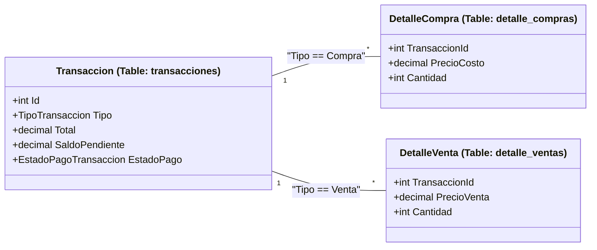
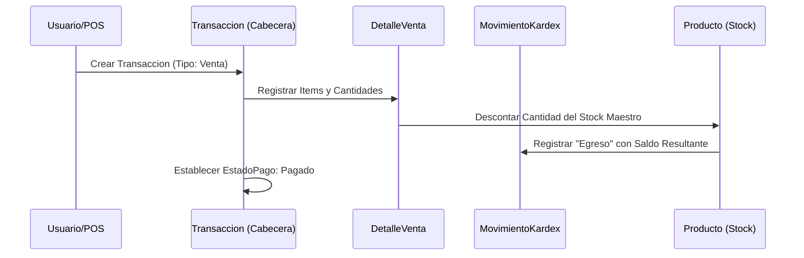

# Modelos de Dominio: Transacciones, Pagos y Kárdex

# Modelos de Dominio: Transacciones, Pagos y Kárdex

Relevant source files

The following files were used as context for generating this wiki page:

- [Models/Compra.cs](Models/Compra.cs)
- [Models/MovimientoKardex.cs](Models/MovimientoKardex.cs)
- [Models/Pago.cs](Models/Pago.cs)
- [Models/Transaccion.cs](Models/Transaccion.cs)
- [inventario.sql](inventario.sql)

Esta sección describe el núcleo operativo del sistema de inventario. A diferencia de los modelos de catálogo, estas entidades gestionan el flujo financiero y físico de los productos, integrando la contabilidad de inventarios con el seguimiento de cuentas por cobrar y pagar.

## 1. Entidades de Transacción y Detalle

El sistema utiliza un modelo de **Cabecera-Detalle** unificado. La clase `Transaccion` actúa como el encabezado común tanto para compras como para ventas, distinguiéndose mediante el enumerado `TipoTransaccion` [Models/Transaccion.cs:9-13]().

### Transaccion (Cabecera)
Representa el documento contable principal. Almacena totales financieros, el estado del recaudo y la relación con el tercero (Proveedor o Cliente) [Models/Transaccion.cs:31-84]().

| Propiedad | Tipo | Descripción |
| :--- | :--- | :--- |
| `Tipo` | `TipoTransaccion` | `Compra` o `Venta` [Models/Transaccion.cs:39](). |
| `EstadoPago` | `EstadoPagoTransaccion` | `Pendiente`, `Parcial` o `Pagado` [Models/Transaccion.cs:60](). |
| `SaldoPendiente` | `decimal` | Monto restante por cubrir en la transacción [Models/Transaccion.cs:64](). |
| `Total` | `decimal` | Valor neto (Subtotal + Impuestos) [Models/Transaccion.cs:55](). |

### Detalle de Transacción
Los detalles se separan en dos tablas físicas para permitir una especialización de costos (Costo en compras vs. Precio en ventas) [Models/Transaccion.cs:26-28]().

*   **DetalleCompra**: Registra `precio_costo` y los impuestos aplicados por el proveedor [Models/Compra.cs:13-44]().
*   **DetalleVenta**: Registra `precio_venta` y los impuestos calculados para el cliente [Models/Compra.cs:49-80]().

### Mapeo de Código a Entidades (Transacciones)

El siguiente diagrama asocia los conceptos de negocio con las clases y tablas definidas en el sistema.

**Diagrama: Relación de Transacciones y Detalles**

**Sources:** [Models/Transaccion.cs:31-84](), [Models/Compra.cs:13-80](), [inventario.sql:83-117]()

---

## 2. Gestión de Pagos y Cartera

El modelo `Pago` permite registrar abonos a una `Transaccion` específica. Esto habilita la gestión de créditos y cuentas por cobrar/pagar.

*   **Ciclo de Pago**: Una transacción puede iniciar con un `EstadoPago` de `Pendiente`. A medida que se insertan registros en la tabla `pagos` [Models/Pago.cs:9-47](), el `SaldoPendiente` de la cabecera disminuye y el `EstadoPago` transiciona hacia `Parcial` o `Pagado` [Models/Transaccion.cs:15-20]().
*   **Atributos clave**: Incluye `MetodoPago` (por defecto "Efectivo") y una `Referencia` para rastrear comprobantes bancarios [Models/Pago.cs:34-39]().

**Sources:** [Models/Pago.cs:1-48](), [Models/Transaccion.cs:15-20]()

---

## 3. Control de Inventario (Kárdex)

El `MovimientoKardex` es el libro auxiliar donde se registra cada variación física de stock en el almacén [Models/MovimientoKardex.cs:16-69]().

### Atributos del Kárdex
*   **Tipo**: `Ingreso` (aumenta stock) o `Egreso` (disminuye stock) [Models/MovimientoKardex.cs:9-13]().
*   **Saldo Resultante**: Almacena el stock total del producto inmediatamente después del movimiento, garantizando la trazabilidad histórica [Models/MovimientoKardex.cs:47]().
*   **Motivo**: Cadena de texto que describe el origen, ej: "Compra #4" o "Ajuste por merma" [Models/MovimientoKardex.cs:54]().

### Ciclo de Vida de una Operación

Cuando se realiza una transacción o un ajuste manual, el sistema sigue un flujo de datos que afecta múltiples modelos simultáneamente.

**Diagrama: Flujo de Datos en una Venta**

**Sources:** [Models/Transaccion.cs:9-13](), [Models/MovimientoKardex.cs:9-13](), [Models/MovimientoKardex.cs:45-47]()

---

## 4. Enumeraciones de Dominio

El sistema utiliza enumeraciones tipadas para asegurar la integridad de la lógica de negocio en los controladores.

| Enumeración | Valores | Propósito |
| :--- | :--- | :--- |
| `TipoTransaccion` | `Compra`, `Venta` | Define la naturaleza del documento y qué tabla de detalle consultar [Models/Transaccion.cs:9-13](). |
| `EstadoPagoTransaccion` | `Pendiente`, `Parcial`, `Pagado` | Controla el flujo de caja y la visibilidad en reportes de cartera [Models/Transaccion.cs:15-20](). |
| `TipoMovimientoKardex` | `Ingreso`, `Egreso` | Determina la operación aritmética sobre el stock del producto [Models/MovimientoKardex.cs:9-13](). |

**Sources:** [Models/Transaccion.cs:9-20](), [Models/MovimientoKardex.cs:9-13]()

---

