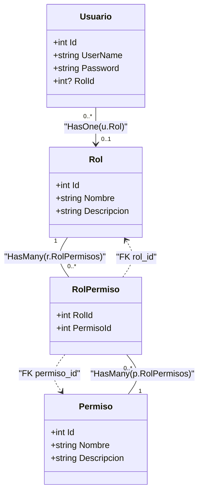
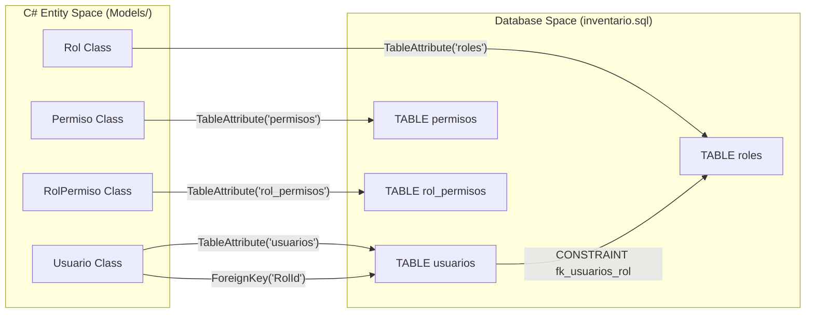

# Modelos de Identidad: Usuario, Rol y Permiso

# Modelos de Identidad: Usuario, Rol y Permiso

Relevant source files

The following files were used as context for generating this wiki page:

- [Data/ApplicationDbContext.cs](Data/ApplicationDbContext.cs)
- [Models/Rol.cs](Models/Rol.cs)
- [Models/Usuario.cs](Models/Usuario.cs)
- [inventario.sql](inventario.sql)

Esta sección describe el sistema de Control de Acceso Basado en Roles (RBAC) implementado en la aplicación. El sistema utiliza una estructura de cuatro entidades principales para gestionar la identidad de los usuarios, sus capacidades dentro del sistema y la persistencia de estas relaciones en la base de datos MySQL.

## Estructura del Modelo de Identidad

El sistema de identidad se aleja de ASP.NET Core Identity predeterminado para implementar una solución personalizada más ligera, utilizando `BCrypt` para el hashing de contraseñas y un esquema de permisos atómicos.

### Diagrama de Entidad-Relación (RBAC)

El siguiente diagrama ilustra cómo se relacionan las entidades de identidad en el código y su correspondencia con la base de datos.

**Diagrama: Relaciones de Identidad en InventarioApp**

**Sources:** [Models/Usuario.cs:10-44](), [Models/Rol.cs:13-72](), [Data/ApplicationDbContext.cs:84-93]()

---

## Detalle de los Modelos

### Usuario
Representa la entidad de acceso al sistema. Incluye validaciones estrictas para el nombre de usuario y el correo electrónico, asegurando la integridad de las credenciales.

*   **Validaciones de Código:**
    *   `UserName`: Solo permite letras, números, puntos y guiones bajos mediante `RegularExpression` [Models/Usuario.cs:22]().
    *   `Password`: Almacena el hash generado por BCrypt (no el texto plano) [Models/Usuario.cs:35]().
*   **Mapeo a Base de Datos:**
    *   Tabla: `usuarios` [Models/Usuario.cs:9]().
    *   Columnas: `username` y `rol_id` utilizan snake_case [Models/Usuario.cs:23-38]().
    *   Restricciones: El `ApplicationDbContext` define índices únicos para `Correo` y `UserName` [Data/ApplicationDbContext.cs:43-51]().

### Rol
Define un conjunto de responsabilidades (ej. "Administrador", "Vendedor").
*   **Relación con Usuarios:** Un rol puede tener múltiples usuarios, pero un usuario pertenece a un solo rol (o ninguno) [Models/Rol.cs:29]().
*   **Comportamiento de Eliminación:** Si se elimina un rol, el campo `RolId` en los usuarios asociados se establece en `NULL` para evitar la pérdida de la cuenta del usuario [Data/ApplicationDbContext.cs:89]().

### Permiso y RolPermiso
El sistema utiliza permisos atómicos (ej. `ventas.registrar`, `productos.eliminar`) en lugar de verificar solo el nombre del rol.
*   **Permiso:** Contiene el nombre técnico del permiso que será verificado en los controladores [Models/Rol.cs:37-45]().
*   **RolPermiso:** Actúa como tabla pivote para la relación muchos-a-muchos entre `Rol` y `Permiso` [Models/Rol.cs:59-72]().
*   **Clave Compuesta:** La entidad `RolPermiso` utiliza una llave primaria compuesta por `RolId` y `PermisoId` [Data/ApplicationDbContext.cs:93]().

**Sources:** [Models/Usuario.cs:9-44](), [Models/Rol.cs:12-72](), [Data/ApplicationDbContext.cs:42-52](), [Data/ApplicationDbContext.cs:85-93]()

---

## Mapeo de Entidades a Base de Datos (SQL)

El esquema físico en MySQL refleja las restricciones definidas en el código mediante Fluent API y Data Annotations.

**Diagrama: Mapeo de Code-First a SQL**

**Sources:** [Models/Usuario.cs:9-43](), [Models/Rol.cs:12-59](), [inventario.sql:136-168]()

### Resumen de Columnas y Tipos

| Entidad | Tabla SQL | Columna Clave | Tipo SQL | Notas |
| :--- | :--- | :--- | :--- | :--- |
| `Usuario` | `usuarios` | `id` | `INT AUTO_INCREMENT` | Posee `uk_usuarios_username` [Data/ApplicationDbContext.cs:51]() |
| `Rol` | `roles` | `id` | `INT AUTO_INCREMENT` | |
| `Permiso` | `permisos` | `id` | `INT AUTO_INCREMENT` | |
| `RolPermiso`| `rol_permisos`| `rol_id`, `permiso_id` | `INT` | Llave primaria compuesta [Data/ApplicationDbContext.cs:93]() |

**Sources:** [Data/ApplicationDbContext.cs:18-26](), [inventario.sql:136-180]()

---

## Uso en el Flujo de Autenticación

Los modelos de identidad no son solo contenedores de datos; son fundamentales para el flujo de seguridad del sistema:

1.  **Carga de Datos:** Durante el inicio de sesión, el sistema consulta el `Usuario` e incluye (`Include`) su `Rol` y la colección de `RolPermisos` asociados.
2.  **Generación de Claims:** El nombre del rol y los nombres de los permisos se transforman en `Claims` de identidad.
3.  **Autorización:** El sistema utiliza estos modelos para alimentar el filtro `RequirePermission`, el cual verifica si el `Permiso.Nombre` asociado al rol del usuario coincide con el requerido por la acción del controlador.
4.  **Auditoría:** El `Usuario.Id` se almacena en la tabla `auditoria_logs` para rastrear qué usuario realizó cada operación [inventario.sql:21-28]().

**Sources:** [Data/ApplicationDbContext.cs:85-93](), [inventario.sql:18-29]()

---

