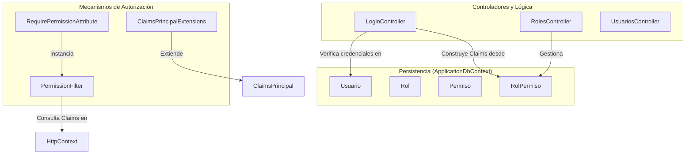
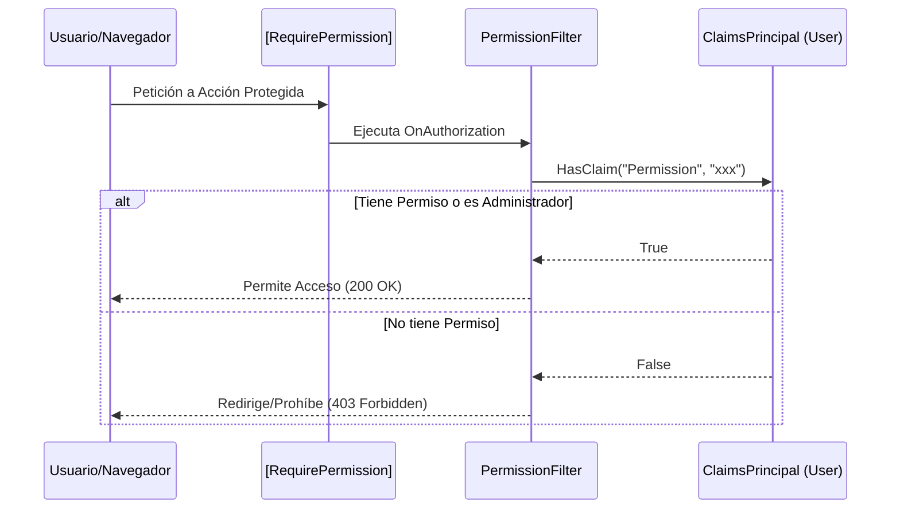

# Autenticación y Autorización

# Autenticación y Autorización

Relevant source files

The following files were used as context for generating this wiki page:

- [Authorization/RequirePermissionAttribute.cs](Authorization/RequirePermissionAttribute.cs)
- [Controllers/LoginController.cs](Controllers/LoginController.cs)
- [Controllers/RolesController.cs](Controllers/RolesController.cs)
- [Extensions/ClaimsPrincipalExtensions.cs](Extensions/ClaimsPrincipalExtensions.cs)

Esta sección describe el sistema de seguridad integral de **InventarioApp**, el cual implementa una arquitectura de autenticación basada en cookies y un control de acceso basado en permisos (RBAC). El sistema está diseñado para ser granular, permitiendo definir qué acciones específicas puede realizar cada usuario según su rol asignado.

### Visión General del Sistema

El sistema de seguridad se divide en tres pilares fundamentales que interactúan para proteger los recursos de la aplicación:

1.  **Autenticación**: Validación de identidad mediante credenciales almacenadas con hash BCrypt y persistencia de sesión a través de cookies de ASP.NET Core.
2.  **Autorización (RBAC)**: Uso de *Claims* de identidad para transportar permisos específicos del usuario, validados mediante filtros de acción personalizados.
3.  **Gestión de Identidad**: Interfaces administrativas para la creación de usuarios y la configuración dinámica de permisos por rol.

#### Mapa de Entidades de Seguridad

El siguiente diagrama muestra la relación entre los componentes de código que gestionan la seguridad y las entidades de persistencia.

**Diagrama: Relación entre Seguridad y Código**

**Sources:** [Controllers/LoginController.cs:14-16](), [Authorization/RequirePermissionAttribute.cs:19-32](), [Extensions/ClaimsPrincipalExtensions.cs:15-16](), [Controllers/RolesController.cs:15-18]()

---

### Flujo de Autenticación

La autenticación se centraliza en el `LoginController`. Cuando un usuario intenta iniciar sesión, el sistema busca al usuario en la base de datos incluyendo su jerarquía de roles y permisos [Controllers/LoginController.cs:36-40](). La contraseña se valida utilizando la librería **BCrypt** para garantizar la seguridad de los hashes almacenados [Controllers/LoginController.cs:42]().

Una vez validado, se genera un `ClaimsPrincipal` que contiene:
*   **Identidad**: ID, Nombre, Email y UserName [Controllers/LoginController.cs:49-56]().
*   **Permisos**: Una lista de claims de tipo `"Permission"` que representan cada acción permitida para el rol del usuario [Controllers/LoginController.cs:61-68]().

Para más detalles sobre el proceso de inicio de sesión, manejo de sesiones y protección contra ataques, consulte:
👉 **[Flujo de Autenticación con Cookies](#3.1)**

---

### Control de Acceso Basado en Permisos (RBAC)

La aplicación utiliza un esquema de permisos granulares (ej: `ventas.registrar`, `productos.editar`) en lugar de depender únicamente de nombres de roles. Esto permite una flexibilidad total al configurar qué puede hacer cada perfil de usuario.

#### Atributo RequirePermission
El control de acceso se implementa mediante el decorador `[RequirePermission("nombre.permiso")]` [Authorization/RequirePermissionAttribute.cs:19-26](). Este atributo utiliza el `PermissionFilter` para interceptar las solicitudes y verificar si el usuario posee el claim correspondiente [Authorization/RequirePermissionAttribute.cs:32-62]().

#### Bypass de Administrador
El sistema incluye una regla de excepción: cualquier usuario con el rol `"Administrador"` tiene acceso total a todos los módulos, ignorando las verificaciones de permisos individuales [Authorization/RequirePermissionAttribute.cs:53-54]().

#### Extensiones de ClaimsPrincipal
Se han implementado métodos de extensión para facilitar la comprobación de permisos tanto en controladores como en vistas Razor:
*   `User.Can("permiso")`: Devuelve un booleano indicando si el usuario tiene la facultad [Extensions/ClaimsPrincipalExtensions.cs:21-22]().
*   `User.UserId()`: Recupera el ID del usuario actual de forma tipada [Extensions/ClaimsPrincipalExtensions.cs:25-29]().

Para conocer la lista completa de permisos y el funcionamiento interno del filtro, consulte:
👉 **[Control de Acceso Basado en Permisos (RBAC)](#3.2)**

---

### Gestión de Usuarios y Roles

La administración de la seguridad se realiza a través de módulos dedicados que permiten la gestión dinámica de la estructura de acceso sin necesidad de cambios en el código.

| Controlador | Responsabilidad Principal |
| :--- | :--- |
| `UsuariosController` | Registro de usuarios, asignación de roles y actualización de perfiles con hashing de contraseñas. |
| `RolesController` | Creación de roles y asignación de permisos mediante una matriz de selección (checkboxes) [Controllers/RolesController.cs:53-60](). |

**Diagrama: Flujo de Autorización en Tiempo de Ejecución**

Para detalles sobre la implementación de los formularios de edición y la lógica de persistencia de roles, consulte:
👉 **[Gestión de Usuarios y Roles](#3.3)**

**Sources:** [Controllers/LoginController.cs:48-76](), [Authorization/RequirePermissionAttribute.cs:41-62](), [Extensions/ClaimsPrincipalExtensions.cs:15-34](), [Controllers/RolesController.cs:69-96]()

---

