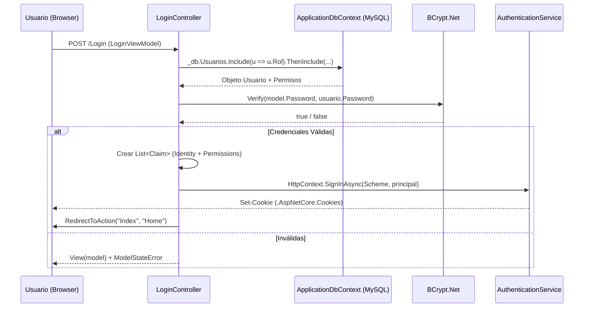

# Flujo de Autenticación con Cookies

# Flujo de Autenticación con Cookies

Relevant source files

The following files were used as context for generating this wiki page:

- [Controllers/LoginController.cs](Controllers/LoginController.cs)
- [Models/LoginViewModel.cs](Models/LoginViewModel.cs)
- [Program.cs](Program.cs)
- [Views/Login/Index.cshtml](Views/Login/Index.cshtml)

Esta sección detalla el proceso de autenticación del sistema InventarioApp, el cual utiliza un esquema basado en cookies de ASP.NET Core. El sistema no solo valida la identidad del usuario mediante credenciales cifradas con **BCrypt**, sino que también construye un árbol de permisos (claims) que habilita el control de acceso basado en roles (RBAC) en toda la aplicación.

## Configuración del Middleware de Autenticación

El sistema está configurado para utilizar `CookieAuthenticationDefaults.AuthenticationScheme`. La configuración global define las rutas de redirección y la persistencia de la sesión.

| Propiedad | Valor / Configuración |
| :--- | :--- |
| **Esquema** | Cookies [Program.cs:16]() |
| **Ruta de Login** | `/Login` [Program.cs:19]() |
| **Ruta de Logout** | `/Login/Logout` [Program.cs:20]() |
| **Expiración** | 8 Horas [Program.cs:22]() |
| **Seguridad** | `HttpOnly = true` para la sesión [Program.cs:38]() |

**Fuentes:**
* [Program.cs:15-23]()
* [Program.cs:35-39]()

---

## Flujo de Inicio de Sesión (Login)

El proceso se centraliza en `LoginController.Index`. Cuando un usuario envía el formulario desde la vista `Views/Login/Index.cshtml`, se ejecutan los siguientes pasos:

### 1. Validación de Modelo y CSRF
La acción está protegida por el atributo `[ValidateAntiForgeryToken]` para prevenir ataques de falsificación de solicitud en sitios cruzados [Controllers/LoginController.cs:30](). El motor de validación de ASP.NET comprueba que los campos `UserName` y `Password` cumplan con las restricciones definidas en `LoginViewModel` [Models/LoginViewModel.cs:8-17]().

### 2. Recuperación de Usuario y Roles
Se realiza una consulta a la base de datos utilizando `Entity Framework Core`, cargando de forma ansiosa (`Include`) la relación con el **Rol** y los **Permisos** asociados para evitar el problema de consultas N+1 [Controllers/LoginController.cs:36-40]().

### 3. Verificación de Credenciales
Se utiliza la librería **BCrypt.Net** para comparar el hash almacenado en la base de datos con la contraseña proporcionada en texto plano [Controllers/LoginController.cs:42]().

### 4. Construcción del ClaimsPrincipal
Si la validación es exitosa, se genera una lista de `Claim` que viajan dentro de la cookie cifrada:
*   **Identidad:** `NameIdentifier` (ID del usuario), `Name`, `Email`, y `UserName` [Controllers/LoginController.cs:49-54]().
*   **Rol:** El nombre del rol asignado [Controllers/LoginController.cs:55]().
*   **Permisos:** Se itera sobre `usuario.Rol.RolPermisos` y se añade un claim de tipo `"Permission"` por cada permiso que posea el usuario [Controllers/LoginController.cs:61-68]().

### 5. Emisión de la Cookie
Se invoca `HttpContext.SignInAsync`, lo que genera la cookie de autenticación en el navegador del cliente [Controllers/LoginController.cs:73]().

### Diagrama de Flujo de Autenticación

Título: Proceso de Autenticación y Emisión de Claims

**Fuentes:**
* [Controllers/LoginController.cs:31-76]()
* [Models/LoginViewModel.cs:1-18]()
* [Views/Login/Index.cshtml:101-133]()

---

## Estructura de la Identidad (Claims)

El sistema transforma las entidades de la base de datos en objetos de identidad de .NET. La siguiente tabla asocia las entidades de código con los claims resultantes.

| Entidad de Código | Propiedad | Tipo de Claim |
| :--- | :--- | :--- |
| `Usuario` | `Id` | `ClaimTypes.NameIdentifier` |
| `Usuario` | `Nombre` | `ClaimTypes.Name` |
| `Rol` | `Nombre` | `ClaimTypes.Role` |
| `Permiso` | `Nombre` | `"Permission"` |

### Diagrama de Mapeo: Datos a ClaimsPrincipal

Título: Mapeo de Entidades a Claims de Identidad

```mermaid
graph TD
    subgraph "Base de Datos (MySQL)"
        U["Usuario Table"]
        R["Rol Table"]
        P["Permiso Table"]
    end

    subgraph "LoginController.cs (Logic)"
        FETCH["_db.Usuarios.FirstOrDefaultAsync()"]
        BUILD["Build Claims List"]
    end

    subgraph "ClaimsPrincipal (Identity)"
        C1["ClaimTypes.NameIdentifier"]
        C2["ClaimTypes.Role"]
        C3["Claim: 'Permission' (Multiple)"]
    end

    U --> FETCH
    R --> FETCH
    P --> FETCH
    FETCH --> BUILD
    BUILD --> C1
    BUILD --> C2
    BUILD --> C3
```

**Fuentes:**
* [Controllers/LoginController.cs:49-68]()
* [Controllers/LoginController.cs:70-71]()

---

## Cierre de Sesión (Logout)

El proceso de salida es gestionado por la acción `Logout`. Esta acción elimina la cookie de autenticación del cliente y redirige a la página de inicio de sesión.

*   **Método:** `HttpContext.SignOutAsync` [Controllers/LoginController.cs:81]().
*   **Redirección:** Al finalizar, el usuario es enviado a `RedirectToAction("Index")` [Controllers/LoginController.cs:82]().

**Fuentes:**
* [Controllers/LoginController.cs:79-83]()
* [Program.cs:20]()

---

## Seguridad y Protección

El flujo implementa varias capas de seguridad integradas:

1.  **Protección CSRF:** El formulario de login utiliza `@Html.AntiForgeryToken()` [Views/Login/Index.cshtml:102]() y el controlador lo valida con `[ValidateAntiForgeryToken]` [Controllers/LoginController.cs:30]().
2.  **Cifrado de Contraseñas:** No se almacenan contraseñas en texto plano; se utiliza `BCrypt` para la verificación [Controllers/LoginController.cs:42]().
3.  **Seguridad de Cookies:** Las cookies están configuradas como `HttpOnly` para mitigar ataques XSS [Program.cs:38]().
4.  **Redirección de Autenticados:** Si un usuario ya autenticado intenta acceder a la página de Login, el controlador lo redirige automáticamente al Dashboard (`Home/Index`) [Controllers/LoginController.cs:22-23]().

**Fuentes:**
* [Controllers/LoginController.cs:20-26]()
* [Views/Login/Index.cshtml:86-98]() (Manejo de errores visuales)

---

