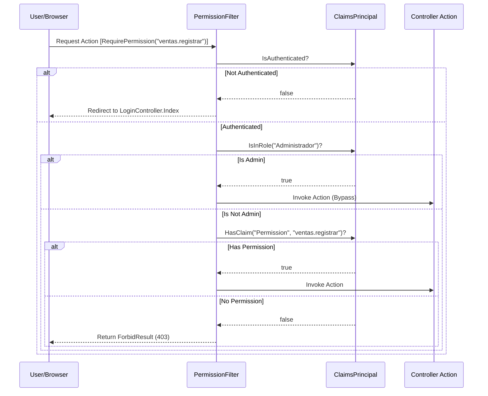
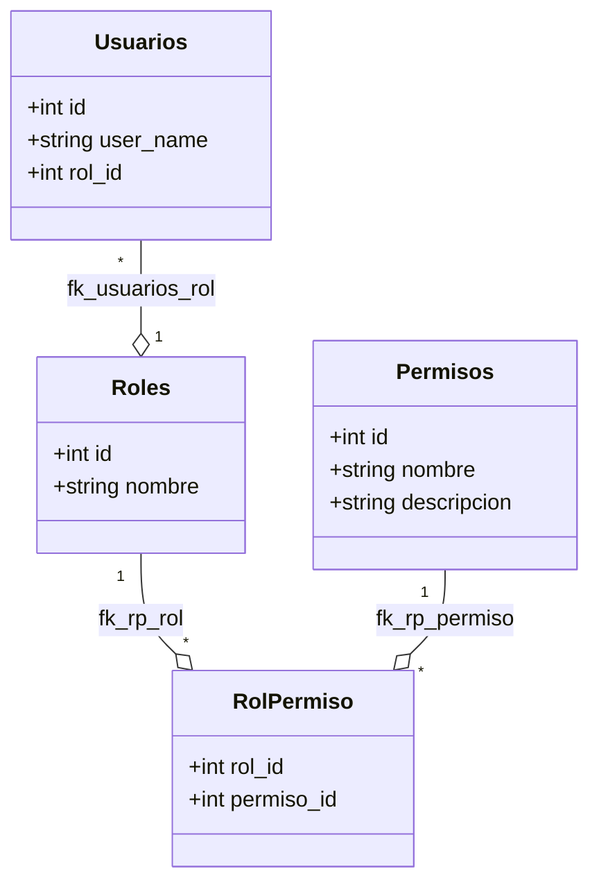

# Control de Acceso Basado en Permisos (RBAC)


# Control de Acceso Basado en Permisos (RBAC)

<details>
<summary>Relevant source files</summary>

The following files were used as context for generating this wiki page:

- [Authorization/RequirePermissionAttribute.cs](Authorization/RequirePermissionAttribute.cs)
- [Controllers/RolesController.cs](Controllers/RolesController.cs)
- [Extensions/ClaimsPrincipalExtensions.cs](Extensions/ClaimsPrincipalExtensions.cs)
- [Models/ViewModels.cs](Models/ViewModels.cs)
- [inventario.sql](inventario.sql)

</details>


El sistema de Control de Acceso Basado en Roles (RBAC) en **InventarioApp** proporciona una granularidad fina para restringir el acceso a funcionalidades específicas del negocio. A diferencia de un sistema simple basado solo en roles, este modelo asocia permisos individuales a los roles, permitiendo una configuración dinámica de lo que cada usuario puede hacer.

## Implementación del Atributo RequirePermission

La autorización se aplica principalmente a nivel de controlador o acción utilizando el atributo personalizado `RequirePermissionAttribute` [Authorization/RequirePermissionAttribute.cs:19-26](). Este atributo actúa como un decorador que utiliza `PermissionFilter` para interceptar la solicitud antes de que llegue a la lógica del negocio.

### Flujo de Autorización

Cuando una solicitud llega a una acción marcada con `[RequirePermission("nombre.permiso")]`, el sistema ejecuta los siguientes pasos:

1.  **Verificación de Autenticación**: Valida si el usuario tiene una identidad activa [Authorization/RequirePermissionAttribute.cs:46-50]().
2.  **Bypass de Administrador**: Si el usuario pertenece al rol con nombre `"Administrador"`, se concede acceso total automáticamente, ignorando la validación del permiso específico [Authorization/RequirePermissionAttribute.cs:53-54]().
3.  **Validación de Claims**: El filtro busca en el `ClaimsPrincipal` del usuario un claim de tipo `"Permission"` cuyo valor coincida con el requerido [Authorization/RequirePermissionAttribute.cs:57-61]().

**Diagrama de Secuencia de Autorización:**


**Sources:** [Authorization/RequirePermissionAttribute.cs:32-62](), [Extensions/ClaimsPrincipalExtensions.cs:15-34]()

---

## Extensiones de ClaimsPrincipal

Para facilitar la verificación de permisos y datos del usuario tanto en controladores como en vistas Razor, el sistema extiende la clase `ClaimsPrincipal` [Extensions/ClaimsPrincipalExtensions.cs:15-34]().

| Método | Retorno | Propósito |
| :--- | :--- | :--- |
| `User.Can(string permission)` | `bool` | Verifica si el usuario posee el claim de permiso indicado [Extensions/ClaimsPrincipalExtensions.cs:21-22](). |
| `User.UserId()` | `int?` | Extrae el `NameIdentifier` del claim y lo convierte a entero [Extensions/ClaimsPrincipalExtensions.cs:25-29](). |
| `User.RoleName()` | `string` | Retorna el valor del claim `Role` o "Sin Rol" por defecto [Extensions/ClaimsPrincipalExtensions.cs:32-33](). |

Estas extensiones permiten ocultar elementos de la interfaz de usuario de forma sencilla:
```html
@if (User.Can("usuarios.ver")) {
    <a href="/Usuarios">Gestionar Usuarios</a>
}
```

**Sources:** [Extensions/ClaimsPrincipalExtensions.cs:1-34]()

---

## Estructura de Datos y Entidades RBAC

El modelo de datos se basa en cuatro tablas principales que definen la jerarquía de acceso: `usuarios`, `roles`, `permisos` y la tabla intermedia `rol_permisos`.

**Relación entre Entidades de Código y Base de Datos:**



### Gestión Dinámica de Permisos
En el `RolesController`, la acción `Edit` permite reconstruir la lista de permisos asociados a un rol. El proceso consiste en eliminar las asociaciones existentes en `_db.RolPermisos` y re-insertar los permisos seleccionados en el `RolEditViewModel` [Controllers/RolesController.cs:83-92]().

**Sources:** [inventario.sql:203-247](), [Controllers/RolesController.cs:69-96](), [Models/ViewModels.cs:73-95]()

---

## Lista de Permisos del Sistema

A continuación se detallan los permisos estándar registrados en la base de datos que controlan el acceso a los módulos principales.

| Módulo | Permiso (System Name) | Descripción Funcional |
| :--- | :--- | :--- |
| **Productos** | `productos.ver` | Acceso a la lista de inventario. |
| | `productos.crear` | Capacidad de registrar nuevos artículos. |
| | `productos.editar` | Modificación de precios y detalles. |
| | `productos.eliminar` | Borrado lógico/físico de productos. |
| **Ventas** | `ventas.ver` | Visualización del historial de ventas. |
| | `ventas.registrar` | Acceso a la terminal de punto de venta (POS). |
| **Compras** | `compras.ver` | Visualización de facturas de proveedores. |
| | `compras.registrar` | Entrada de mercancía al sistema. |
| **Seguridad** | `usuarios.ver` | Gestión de la lista de usuarios. |
| | `roles.ver` | Visualización de roles existentes. |
| | `roles.editar` | Configuración de la matriz de permisos. |
| **Auditoría** | `auditoria.ver` | Acceso a los logs de actividad del sistema. |

**Sources:** [inventario.sql:165-185](), [Controllers/RolesController.cs:21-22](), [Controllers/RolesController.cs:35-36]()

---

