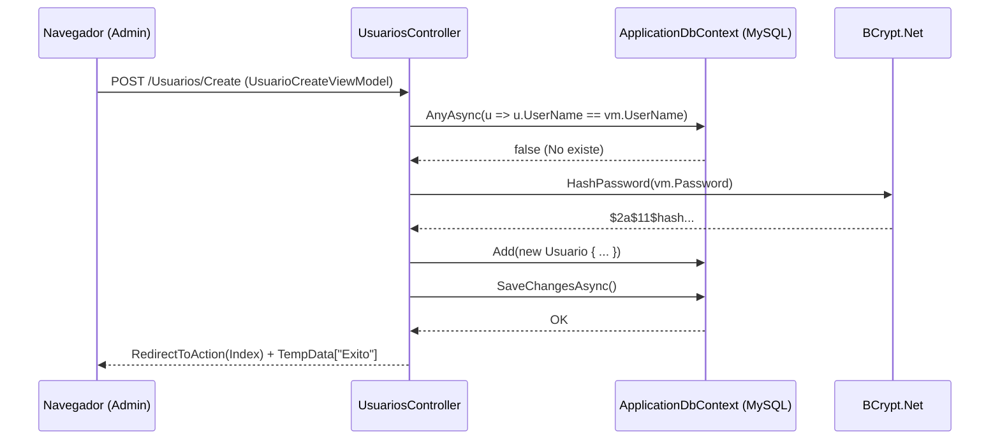
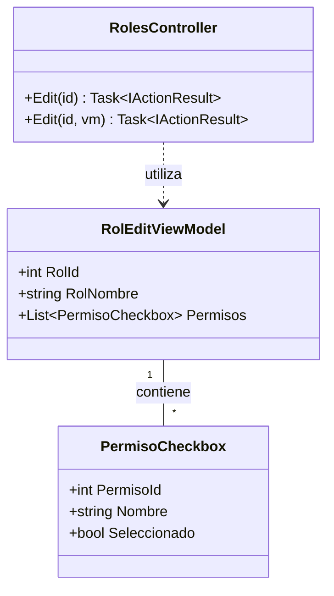
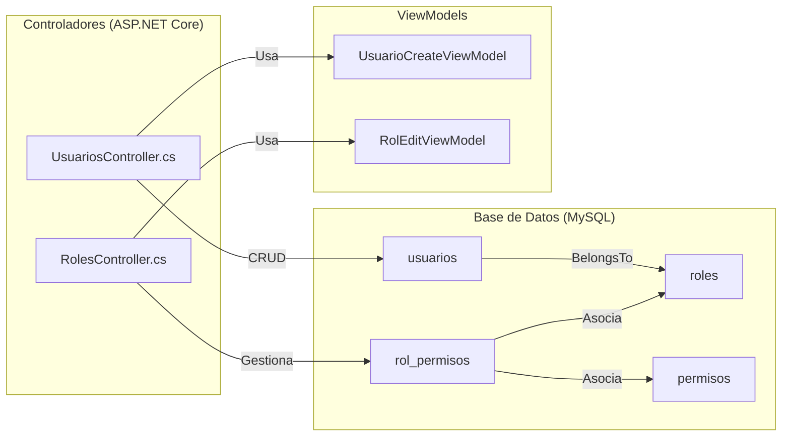

# Gestión de Usuarios y Roles

# Gestión de Usuarios y Roles

Relevant source files

The following files were used as context for generating this wiki page:

- [Controllers/RolesController.cs](Controllers/RolesController.cs)
- [Controllers/UsuariosController.cs](Controllers/UsuariosController.cs)
- [Extensions/ClaimsPrincipalExtensions.cs](Extensions/ClaimsPrincipalExtensions.cs)
- [Models/ViewModels.cs](Models/ViewModels.cs)
- [Views/Roles/Edit.cshtml](Views/Roles/Edit.cshtml)
- [Views/Roles/Index.cshtml](Views/Roles/Index.cshtml)
- [Views/Usuarios/Create.cshtml](Views/Usuarios/Create.cshtml)
- [Views/Usuarios/Edit.cshtml](Views/Usuarios/Edit.cshtml)
- [Views/Usuarios/Index.cshtml](Views/Usuarios/Index.cshtml)

Esta sección detalla la implementación técnica del sistema de administración de identidades y el control de acceso basado en roles (RBAC). El sistema permite la gestión completa de cuentas de usuario con seguridad criptográfica y la configuración granular de permisos por cada rol.

## Gestión de Usuarios (UsuariosController)

El `UsuariosController` implementa las operaciones CRUD para la entidad `Usuario`. Utiliza el patrón ViewModel para separar la lógica de presentación de los modelos de base de datos y aplica seguridad mediante el atributo `[RequirePermission]` en cada acción [Controllers/UsuariosController.cs:15-17]().

### Flujo de Creación y Hash de Contraseñas
Cuando se registra un nuevo usuario, el sistema realiza las siguientes validaciones y transformaciones:
1.  **Validación de Unicidad**: Se verifica que el `UserName` y el `Correo` no existan previamente en la base de datos [Controllers/UsuariosController.cs:66-74]().
2.  **Seguridad**: La contraseña se procesa utilizando **BCrypt** para generar un hash seguro antes de persistir el registro [Controllers/UsuariosController.cs:87]().
3.  **Asignación de Rol**: Se vincula el usuario a un `RolId` seleccionado desde un `SelectList` poblado dinámicamente [Controllers/UsuariosController.cs:50]().

### Validación en Tiempo Real
La vista `Create` y `Edit` implementan una validación asíncrona (AJAX) para el nombre de usuario. El campo `inpUserName` dispara una consulta al endpoint `VerificarUserName` para informar al administrador si el nombre está disponible antes de enviar el formulario [Views/Usuarios/Create.cshtml:121-135]().

### Diagrama de Secuencia: Creación de Usuario
Este diagrama ilustra la interacción entre la UI, el controlador y la capa de datos.

**Secuencia de Registro de Usuario**

*Sources: [Controllers/UsuariosController.cs:58-94](), [Views/Usuarios/Create.cshtml:97-140]()*

---

## Gestión de Roles y Permisos (RolesController)

El sistema de roles permite una asignación dinámica de permisos. A diferencia de los usuarios, los roles no se eliminan frecuentemente para mantener la integridad referencial, centrándose en la edición de sus capacidades [Controllers/RolesController.cs:35-36]().

### Edición Dinámica de Permisos
La acción `Edit` de `RolesController` utiliza el `RolEditViewModel` para enviar a la vista una lista de objetos `PermisoCheckbox` [Models/ViewModels.cs:89-95](). 
- **Carga de Datos**: Recupera todos los permisos disponibles en el sistema y marca como `Seleccionado = true` aquellos que el rol ya posee mediante un `HashSet` para optimizar la búsqueda [Controllers/RolesController.cs:44-45]().
- **Persistencia**: Al guardar, se utiliza `RemoveRange` para limpiar las relaciones previas en la tabla intermedia `RolPermisos` y se insertan las nuevas selecciones en una sola transacción [Controllers/RolesController.cs:84-92]().

### Interfaz de Usuario Agrupada
En la vista `Views/Roles/Edit.cshtml`, los permisos se agrupan visualmente por módulos (productos, ventas, usuarios, etc.) analizando el prefijo del nombre del permiso (ej. `ventas.ver` pertenece al grupo `ventas`) [Views/Roles/Edit.cshtml:6-21]().

**Estructura de Datos de Roles**

*Sources: [Controllers/RolesController.cs:48-60](), [Models/ViewModels.cs:73-95]()*

---

## Componentes de la Interfaz (Views)

### Listado de Usuarios (Index)
Utiliza la librería **Tabulator** para renderizar una tabla interactiva que consume datos del endpoint `ObtenerTodos` [Views/Usuarios/Index.cshtml:40-41]().
- **Formatters**: La columna "Rol" utiliza un formateador de celdas para aplicar badges de colores según el nombre del rol (Púrpura para Administrador, Azul para Vendedor) [Views/Usuarios/Index.cshtml:34-58]().
- **Seguridad UI**: Los botones de "Editar" y "Eliminar" solo se renderizan si el usuario autenticado tiene los permisos `usuarios.editar` o `usuarios.eliminar` [Views/Usuarios/Index.cshtml:31-32]().

### Edición de Usuario (Edit)
El formulario de edición permite actualizar datos básicos y el rol. El campo de contraseña es opcional: si se deja vacío, el controlador mantiene el hash existente en la base de datos [Controllers/UsuariosController.cs:153-154]().

### Resumen de Roles (Index)
Muestra tarjetas (`cards`) por cada rol, listando los permisos asignados en una lista con scroll y el conteo de usuarios vinculados [Views/Roles/Index.cshtml:14-31]().

| Acción | Endpoint | Requisito de Permiso |
| :--- | :--- | :--- |
| Ver Lista | `GET /Usuarios` | `usuarios.ver` |
| Crear | `POST /Usuarios/Create` | `usuarios.crear` |
| Editar | `POST /Usuarios/Edit/{id}` | `usuarios.editar` |
| Eliminar | `POST /Usuarios/Delete/{id}` | `usuarios.eliminar` |
| Ver Roles | `GET /Roles` | `roles.ver` |
| Editar Rol | `POST /Roles/Edit/{id}` | `roles.editar` |

*Sources: [Controllers/UsuariosController.cs:22-164](), [Controllers/RolesController.cs:21-68]()*

---

## Integración con el Sistema de Autorización

La gestión de usuarios y roles alimenta directamente las extensiones de `ClaimsPrincipal`. Cuando un usuario inicia sesión, sus permisos (definidos en la tabla `RolPermisos`) se cargan como claims de tipo `Permission`.

- **User.Can(permission)**: Método de extensión que verifica si el claim existe para el usuario actual [Extensions/ClaimsPrincipalExtensions.cs:21-22]().
- **User.RoleName()**: Recupera el nombre del rol del claim de identidad [Extensions/ClaimsPrincipalExtensions.cs:32-33]().

**Mapeo de Entidades a Código**

*Sources: [Controllers/UsuariosController.cs:16-19](), [Controllers/RolesController.cs:15-18](), [Models/ViewModels.cs:10-95]()*

**Sources:**
- `Controllers/UsuariosController.cs`
- `Controllers/RolesController.cs`
- `Models/ViewModels.cs`
- `Views/Usuarios/Index.cshtml`
- `Views/Usuarios/Create.cshtml`
- `Views/Usuarios/Edit.cshtml`
- `Views/Roles/Index.cshtml`
- `Views/Roles/Edit.cshtml`
- `Extensions/ClaimsPrincipalExtensions.cs`

---

