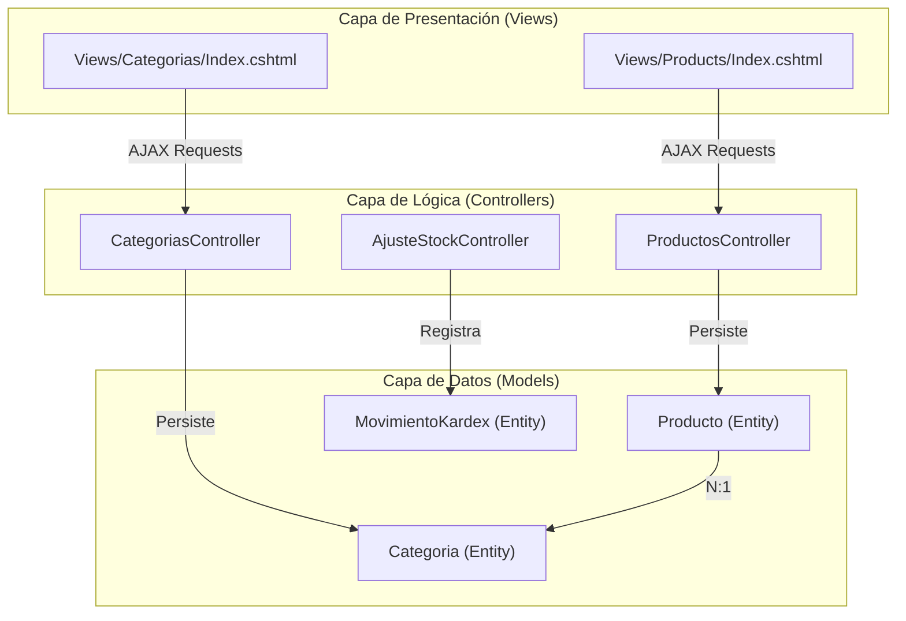
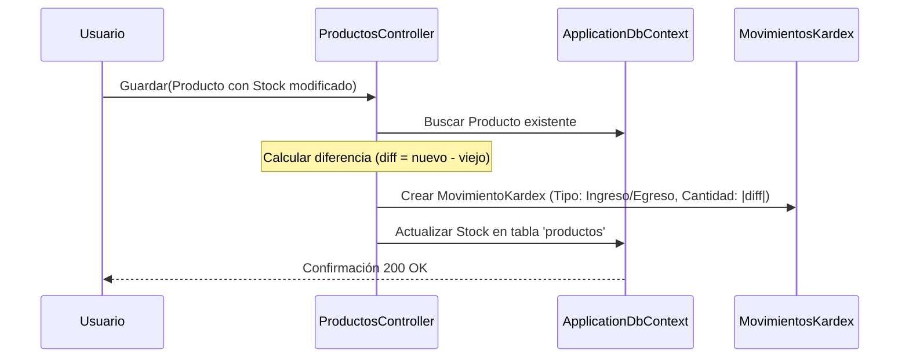

# Módulos de Negocio: Inventario y Catálogo

# Módulos de Negocio: Inventario y Catálogo

Relevant source files

The following files were used as context for generating this wiki page:

- [Controllers/ProductosController.cs](Controllers/ProductosController.cs)
- [Models/Categoria.cs](Models/Categoria.cs)
- [Models/Producto.cs](Models/Producto.cs)

Esta sección describe los módulos centrales para la administración de bienes en el sistema. Estos módulos permiten definir la estructura del catálogo (Categorías e Impuestos) y gestionar el ciclo de vida de las existencias (Productos y Kárdex). El sistema utiliza un enfoque de **Single Page Interface (SPI)** dentro de cada módulo mediante peticiones AJAX y la librería **Tabulator** para la visualización de datos.

## Estructura del Módulo de Inventario

El sistema desacopla la definición lógica del producto de su historial de movimientos. Mientras que la entidad `Producto` mantiene el estado actual (stock, precio), la entidad `MovimientoKardex` registra cada cambio para auditoría y trazabilidad.

### Mapeo de Entidades de Negocio a Código

El siguiente diagrama muestra cómo los conceptos de negocio se traducen en clases y controladores dentro del código fuente.

**Diagrama: Entidades de Catálogo e Inventario**

Sources: [Models/Producto.cs:10-53](), [Models/Categoria.cs:10-22](), [Controllers/ProductosController.cs:13-136]()

## Gestión de Productos

El módulo de productos es el eje central del inventario. Cada producto está vinculado a una categoría y, opcionalmente, a un esquema de impuestos.

*   **Atributos Clave**: Incluye `Nombre`, `Precio`, `Stock` y `categoria_id` [Models/Producto.cs:15-36]().
*   **Alertas de Inventario**: El modelo incluye una propiedad calculada `StockBajo` que se activa cuando las existencias son menores a 5 unidades [Models/Producto.cs:51-52]().
*   **Sincronización de Stock**: Cualquier cambio manual en el stock desde el formulario de edición dispara automáticamente un registro en el Kárdex para justificar la diferencia [Controllers/ProductosController.cs:90-103]().

Para detalles técnicos sobre la implementación de la tabla dinámica y validaciones, consulte:
**[Gestión de Productos](#4.1)**

## Gestión de Categorías

Este módulo permite organizar los productos en grupos lógicos. Es una estructura jerárquica simple donde una categoría puede contener múltiples productos [Models/Categoria.cs:21-21]().

*   **Funcionalidad**: El `CategoriasController` expone endpoints para operaciones CRUD rápidas consumidas por la vista `Categorias/Index.cshtml`.
*   **Integración**: Las categorías son cargadas en el `ViewBag` del `ProductosController` para poblar los selectores de creación de productos [Controllers/ProductosController.cs:22-22]().

Para detalles sobre el flujo de datos de categorías, consulte:
**[Gestión de Categorías](#4.2)**

## Ajuste de Kárdex (Stock Manual)

El sistema no permite que el stock cambie "en el vacío". Cada alteración debe estar respaldada por un movimiento de Kárdex.

*   **Movimientos Automáticos**: Al crear un producto con stock inicial, se genera un movimiento de tipo `Ingreso` [Controllers/ProductosController.cs:72-81]().
*   **Ajustes Manuales**: El `AjusteStockController` gestiona entradas y salidas excepcionales (por ejemplo, merma o donaciones), asegurando que el saldo final en `MovimientoKardex` coincida con el `Stock` actual en la tabla de productos.

**Diagrama: Flujo de Actualización de Stock**

Sources: [Controllers/ProductosController.cs:60-115]()

Para detalles sobre la lógica de validación de egresos y tipos de movimientos, consulte:
**[Ajuste de Kárdex (Stock Manual)](#4.3)**

## Resumen de Entidades Principales

| Clase | Tabla | Responsabilidad |
| :--- | :--- | :--- |
| `Producto` | `productos` | Almacena el estado maestro del artículo y su precio. |
| `Categoria` | `categorias` | Clasificación lógica para reportes y filtros. |
| `MovimientoKardex` | `movimientos_kardex` | Historial inmutable de entradas y salidas de stock. |

Sources: [Models/Producto.cs:9-13](), [Models/Categoria.cs:9-13]()

---

