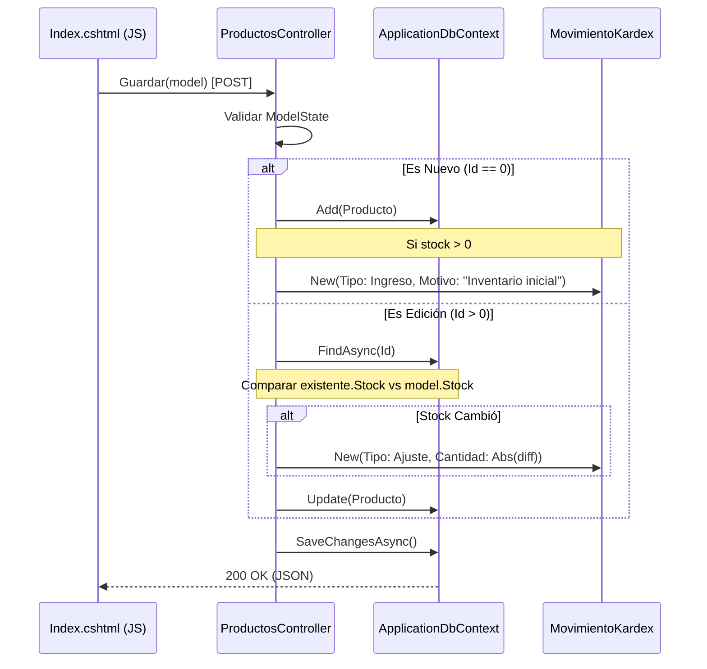
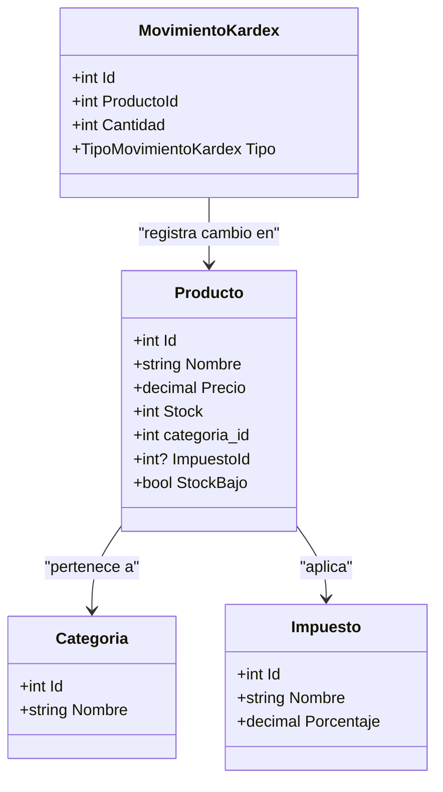

# Gestión de Productos

# Gestión de Productos

Relevant source files

The following files were used as context for generating this wiki page:

- [Controllers/ProductosController.cs](Controllers/ProductosController.cs)
- [Models/Impuesto.cs](Models/Impuesto.cs)
- [Models/Producto.cs](Models/Producto.cs)
- [Views/Productos/Index.cshtml](Views/Productos/Index.cshtml)

El módulo de Gestión de Productos centraliza la administración del catálogo de artículos del sistema. Implementa una interfaz dinámica basada en AJAX que permite realizar operaciones CRUD (Crear, Leer, Actualizar, Eliminar) sin recargar la página, integrando validaciones de stock, cálculos de impuestos y registro automático en el historial de movimientos (Kárdex).

### Implementación del Controlador

El `ProductosController` actúa como el mediador entre la base de datos y la interfaz de usuario, exponiendo endpoints que retornan datos en formato JSON para ser consumidos por la librería Tabulator.

| Endpoint | Método | Propósito |
| :--- | :--- | :--- |
| `Index` | `GET` | Carga la vista principal y precarga Categorías e Impuestos en el `ViewBag` [Controllers/ProductosController.cs:19-25](). |
| `ObtenerTodos` | `GET` | Retorna la lista de productos filtrada, incluyendo datos relacionados de `Categoria` e `Impuesto` [Controllers/ProductosController.cs:31-57](). |
| `ObtenerPorId` | `GET` | Recupera un producto específico para poblar el modal de edición [Controllers/ProductosController.cs:130-135](). |
| `Guardar` | `POST` | Crea o actualiza un producto y genera registros en `MovimientosKardex` si hay cambios de stock [Controllers/ProductosController.cs:61-115](). |
| `Eliminar` | `DELETE` | Remueve un producto de la base de datos por su ID [Controllers/ProductosController.cs:119-126](). |

**Fuentes:**
- [Controllers/ProductosController.cs:13-136]()
- [Models/Producto.cs:10-53]()

### Flujo de Datos: CRUD y Kárdex

Cuando se guarda un producto, el sistema no solo persiste la entidad `Producto`, sino que también garantiza la trazabilidad del inventario. Si el producto es nuevo y tiene stock inicial, o si es una edición donde el stock fue modificado manualmente, se inserta un registro en la tabla `movimientos_kardex`.

#### Diagrama de Secuencia: Guardado de Producto
Este diagrama asocia las acciones del usuario con las funciones del controlador y las entidades de base de datos.

**Fuentes:**
- [Controllers/ProductosController.cs:61-115]()
- [Models/Producto.cs:32-32]()

### Interfaz de Usuario (Frontend)

La vista `Views/Productos/Index.cshtml` utiliza una arquitectura Single Page dentro del módulo. Se apoya en **Tabulator** para la visualización de datos y **Tailwind CSS** para el diseño de los componentes.

#### Tabla de Productos (Tabulator)
La tabla se configura para detectar automáticamente niveles críticos de inventario. Si la propiedad calculada `StockBajo` (definida como `Stock < 5`) es verdadera, la fila o celda recibe estilos de alerta visual [Models/Producto.cs:51-52]().

#### Modal de Gestión
El modal es polimórfico: se utiliza tanto para creación como para edición.
- **Validación Cliente:** Antes de enviar el `POST`, se verifican campos obligatorios como Nombre, Precio, Stock, Categoría e Impuesto [Views/Productos/Index.cshtml:75-115]().
- **Selects Dinámicos:** Las opciones de Categoría e Impuesto se cargan desde el `ViewBag` enviado por el controlador [Views/Productos/Index.cshtml:105-108]().

#### Diagrama de Entidades: Producto y Relaciones
Relación entre los modelos de código y sus campos clave en la base de datos.

**Fuentes:**
- [Views/Productos/Index.cshtml:1-115]()
- [Models/Producto.cs:9-53]()
- [Models/Impuesto.cs:9-25]()

### Alertas de Stock Bajo
El sistema implementa una alerta global en la parte superior de la vista que se activa mediante JavaScript si el set de datos devuelto por `ObtenerTodos` contiene al menos un producto con `StockBajo == true`.

- **Visualización:** Se muestra un banner rojo con el ID `alerta-stock` [Views/Productos/Index.cshtml:32-42]().
- **Lógica:** La propiedad `StockBajo` no está mapeada a la base de datos (`[NotMapped]`), se calcula en tiempo real en el servidor y se envía en el JSON [Models/Producto.cs:51-53]().

**Fuentes:**
- [Models/Producto.cs:51-53]()
- [Controllers/ProductosController.cs:53-53]()
- [Views/Productos/Index.cshtml:32-42]()

---

