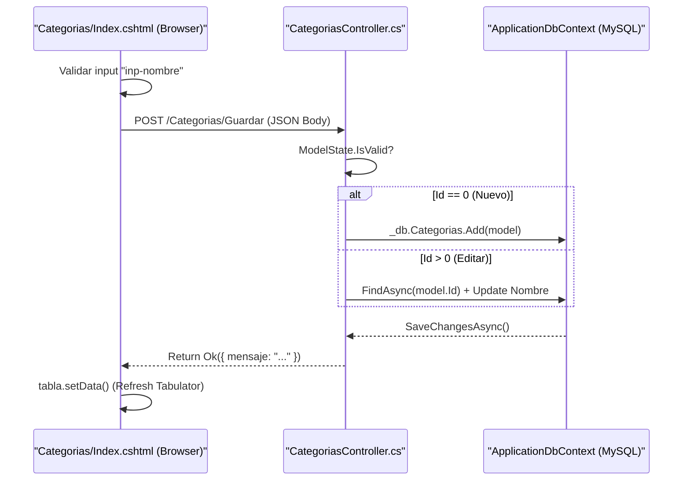
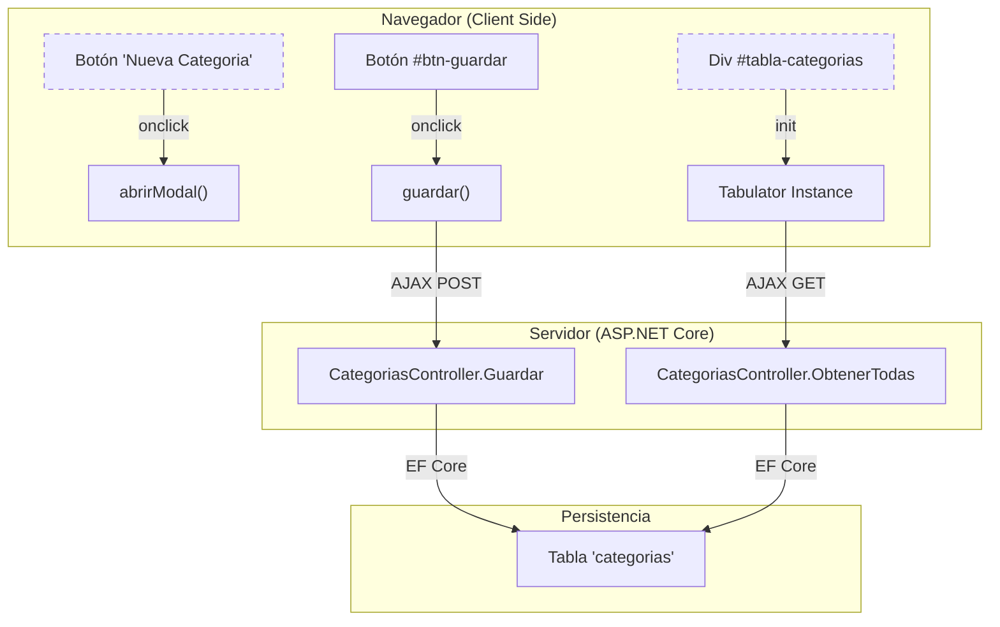

# Gestión de Categorías

# Gestión de Categorías

Relevant source files

The following files were used as context for generating this wiki page:

- [Controllers/CategoriasController.cs](Controllers/CategoriasController.cs)
- [Models/Categoria.cs](Models/Categoria.cs)
- [Views/Categorias/Index.cshtml](Views/Categorias/Index.cshtml)

El módulo de **Gestión de Categorías** permite la organización jerárquica de los productos dentro del sistema. Se implementa mediante un controlador de ASP.NET Core que expone una API JSON y una vista basada en componentes modernos de UI para ofrecer una experiencia de usuario fluida sin recargas de página completas.

## 1. Implementación del Servidor (CategoriasController)

El `CategoriasController` gestiona las operaciones CRUD utilizando **Entity Framework Core** y el contexto de base de datos `ApplicationDbContext` [Controllers/CategoriasController.cs:15-16](). El controlador está protegido por el atributo `[Authorize]`, requiriendo una sesión activa para cualquier operación [Controllers/CategoriasController.cs:12-13]().

### Endpoints AJAX

| Método | Ruta | Descripción |
| :--- | :--- | :--- |
| `GET` | `/Categorias/Index` | Carga la vista principal [Controllers/CategoriasController.cs:19](). |
| `GET` | `/Categorias/ObtenerTodas` | Retorna un listado JSON de todas las categorías (Id y Nombre) [Controllers/CategoriasController.cs:25-31](). |
| `POST` | `/Categorias/Guardar` | Crea una nueva categoría o actualiza una existente basándose en si el `Id` es 0 o mayor [Controllers/CategoriasController.cs:35-51](). |
| `DELETE` | `/Categorias/Eliminar/{id}` | Elimina una categoría si no tiene productos vinculados [Controllers/CategoriasController.cs:55-68](). |

### Validación de Integridad Referencial
Antes de eliminar una categoría, el controlador realiza una verificación de seguridad:
- Consulta la tabla `Productos` para verificar si algún registro depende de la categoría actual [Controllers/CategoriasController.cs:61-63]().
- Si existen productos asociados, retorna un `BadRequest` con un mensaje de error descriptivo para evitar inconsistencias en la base de datos [Controllers/CategoriasController.cs:63]().

**Sources:**
- [Controllers/CategoriasController.cs:1-70]()
- [Models/Categoria.cs:1-22]()

---

## 2. Modelo de Datos y Flujo de Información

El modelo `Categoria` mapea directamente a la tabla `categorias` [Models/Categoria.cs:9-11](). Incluye validaciones de datos como el nombre obligatorio y longitud máxima de 100 caracteres [Models/Categoria.cs:15-18]().

### Diagrama: Flujo de Guardado de Categoría
Este diagrama conecta los elementos de la interfaz de usuario con la lógica del servidor y la persistencia.

**Sources:**
- [Models/Categoria.cs:10-22]()
- [Controllers/CategoriasController.cs:35-51]()
- [Views/Categorias/Index.cshtml:97-125]()

---

## 3. Interfaz de Usuario (Frontend)

La vista `Views/Categorias/Index.cshtml` utiliza una arquitectura Single Page dentro del módulo para gestionar el listado y los formularios.

### Tabla de Datos (Tabulator)
Se utiliza la librería **Tabulator** para renderizar el listado. La tabla se inicializa apuntando al endpoint `/Categorias/ObtenerTodas` [Views/Categorias/Index.cshtml:97-98]().
- **Paginación:** Local (10 registros por página) [Views/Categorias/Index.cshtml:101-102]().
- **Formateadores:** Se utilizan funciones JavaScript para inyectar estilos de Tailwind CSS en las celdas de ID y Nombre [Views/Categorias/Index.cshtml:105-112]().
- **Acciones:** Cada fila incluye botones para `editar()` y `eliminar()`, que invocan funciones JavaScript para manipular el DOM o realizar peticiones `fetch` [Views/Categorias/Index.cshtml:118-125]().

### Modal de Gestión
El modal se utiliza tanto para la creación como para la edición, alternando su comportamiento mediante JavaScript:
- **Campos:** Un input de texto para el nombre (`inp-nombre`) y un input oculto para el ID (`inp-id`) [Views/Categorias/Index.cshtml:53-76]().
- **Validación Cliente:** Antes de enviar la petición al servidor, se verifica que el campo de nombre no esté vacío, mostrando un mensaje de error `err-nombre` si falla [Views/Categorias/Index.cshtml:61-66]().

### Diagrama: Asociación de UI con Código

**Sources:**
- [Views/Categorias/Index.cshtml:6-18]()
- [Views/Categorias/Index.cshtml:39-92]()
- [Views/Categorias/Index.cshtml:97-125]()

---

## 4. Lógica de Negocio y Validaciones

1.  **Unicidad y Requerimiento:** El modelo `Categoria` impone que el nombre es obligatorio a nivel de servidor mediante `DataAnnotations` [Models/Categoria.cs:15]().
2.  **Prevención de Errores en Eliminación:** La lógica en `Eliminar(int id)` previene la rotura de la integridad referencial. Si un producto pertenece a una categoría, la base de datos MySQL (vía EF Core) lanzaría un error de llave foránea; el controlador intercepta esto preventivamente mediante `_db.Productos.AnyAsync(...)` [Controllers/CategoriasController.cs:61-63]().
3.  **Sanitización:** Al editar, el nombre de la categoría se escapa de comillas simples en el formateador de Tabulator para evitar errores de sintaxis en el paso de parámetros a la función `editar()` [Views/Categorias/Index.cshtml:121]().

**Sources:**
- [Controllers/CategoriasController.cs:55-68]()
- [Models/Categoria.cs:15-18]()
- [Views/Categorias/Index.cshtml:121]()

---

