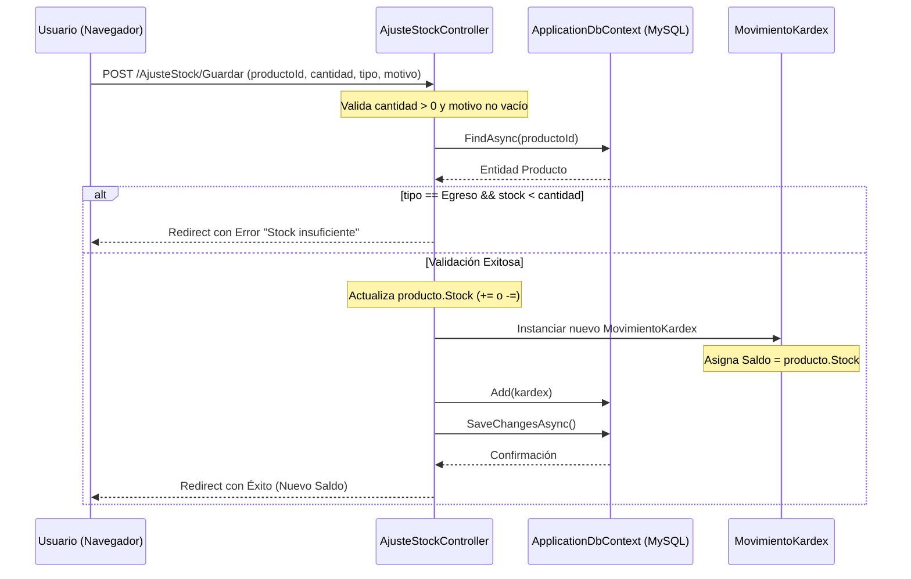
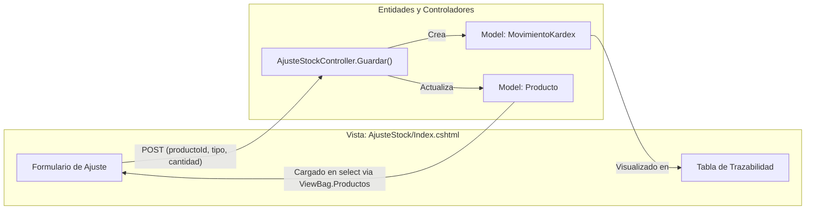

# Ajuste de Kárdex (Stock Manual)

# Ajuste de Kárdex (Stock Manual)

Relevant source files

The following files were used as context for generating this wiki page:

- [Controllers/AjusteStockController.cs](Controllers/AjusteStockController.cs)
- [Models/MovimientoKardex.cs](Models/MovimientoKardex.cs)
- [Views/AjusteStock/Index.cshtml](Views/AjusteStock/Index.cshtml)

El módulo de **Ajuste de Kárdex** permite a los usuarios autorizados realizar modificaciones manuales al inventario de los productos sin necesidad de registrar una compra o venta formal. Este componente es crítico para la gestión de mermas, correcciones por conteo físico o ingresos excepcionales de mercancía.

## Visión General

El ajuste manual se centraliza en el `AjusteStockController`, el cual interactúa directamente con la tabla `productos` para actualizar el stock maestro y con la tabla `movimientos_kardex` para mantener la trazabilidad histórica de cada cambio [Controllers/AjusteStockController.cs:12-17]().

### Flujo de Datos de Ajuste Manual

El siguiente diagrama describe cómo una solicitud de ajuste viaja desde la interfaz de usuario hasta la persistencia en la base de datos, involucrando validaciones de negocio y actualización de saldos.

**Diagrama: Flujo de Registro de Ajuste Manual**

Sources: [Controllers/AjusteStockController.cs:37-90](), [Models/MovimientoKardex.cs:16-69]()

## Implementación Técnica

### El Controlador: AjusteStockController

El controlador está protegido por el atributo `[Authorize]` y requiere específicamente el permiso `kardex.ajustar` [Controllers/AjusteStockController.cs:14-15](). 

#### Método Index (Visualización)
Carga la lista de productos para el selector del formulario y recupera los últimos 50 registros de la tabla `movimientos_kardex`, incluyendo las relaciones con `Producto` y `Usuario` para mostrar quién realizó cada ajuste [Controllers/AjusteStockController.cs:22-35]().

#### Método Guardar (Lógica de Negocio)
Es el núcleo del módulo. Realiza las siguientes acciones:
1.  **Validación de Entrada**: Comprueba que la cantidad sea positiva y exista una justificación [Controllers/AjusteStockController.cs:42-46]().
2.  **Validación de Disponibilidad**: En caso de `TipoMovimientoKardex.Egreso`, verifica que el `producto.Stock` actual sea suficiente para cubrir el ajuste [Controllers/AjusteStockController.cs:56-60]().
3.  **Actualización del Maestro**: Modifica la propiedad `Stock` de la entidad `Producto` en memoria [Controllers/AjusteStockController.cs:63-66]().
4.  **Auditoría de Usuario**: Extrae el ID del usuario actual desde los claims (`ClaimTypes.NameIdentifier`) para asociarlo al movimiento [Controllers/AjusteStockController.cs:69-71]().
5.  **Persistencia**: Crea el objeto `MovimientoKardex` con el prefijo "Ajuste Manual: " en el motivo y guarda los cambios en la base de datos [Controllers/AjusteStockController.cs:74-86]().

### El Modelo: MovimientoKardex

La entidad `MovimientoKardex` actúa como el libro contable de artículos. Cada fila representa un cambio en el inventario físico.

| Propiedad | Tipo | Descripción |
| :--- | :--- | :--- |
| `Tipo` | `TipoMovimientoKardex` | Enum: `Ingreso` (suma) o `Egreso` (resta) [Models/MovimientoKardex.cs:9-13](). |
| `Cantidad` | `int` | Magnitud del ajuste solicitado. |
| `Saldo` | `int` | **Stock resultante** después de aplicar el movimiento (Snapshot del inventario) [Models/MovimientoKardex.cs:45-47](). |
| `Motivo` | `string` | Texto descriptivo para auditoría (máx. 200 caracteres) [Models/MovimientoKardex.cs:51-54](). |
| `UsuarioId` | `int?` | FK al usuario que ejecutó la acción [Models/MovimientoKardex.cs:64-68](). |

Sources: [Models/MovimientoKardex.cs:16-69](), [Controllers/AjusteStockController.cs:74-83]()

## Interfaz de Usuario (UI)

La vista `AjusteStock/Index.cshtml` utiliza un diseño de dos columnas: un formulario lateral para la entrada de datos y una tabla principal para el historial [Views/AjusteStock/Index.cshtml:7-121]().

**Diagrama: Asociación UI a Entidades de Código**

Sources: [Views/AjusteStock/Index.cshtml:23-59](), [Controllers/AjusteStockController.cs:24-34](), [Controllers/AjusteStockController.cs:40-41]()

### Elementos Clave de la UI
*   **Selector de Productos**: Muestra el nombre y el saldo actual en tiempo real mediante una iteración sobre `ViewBag.Productos` [Views/AjusteStock/Index.cshtml:30-34]().
*   **Identificación de Operador**: En la tabla de historial, si el `UsuarioId` es nulo, se muestra como "Sistema Automático" (usado para movimientos generados por Compras/Ventas), de lo contrario muestra el nombre del operador [Views/AjusteStock/Index.cshtml:95]().
*   **Indicadores Visuales**: Los ingresos se resaltan con `text-emerald-600` (+) y los egresos con `text-red-500` (-) para facilitar la lectura rápida [Views/AjusteStock/Index.cshtml:102-109]().

Sources: [Views/AjusteStock/Index.cshtml:1-122](), [Controllers/AjusteStockController.cs:1-91]()

---

