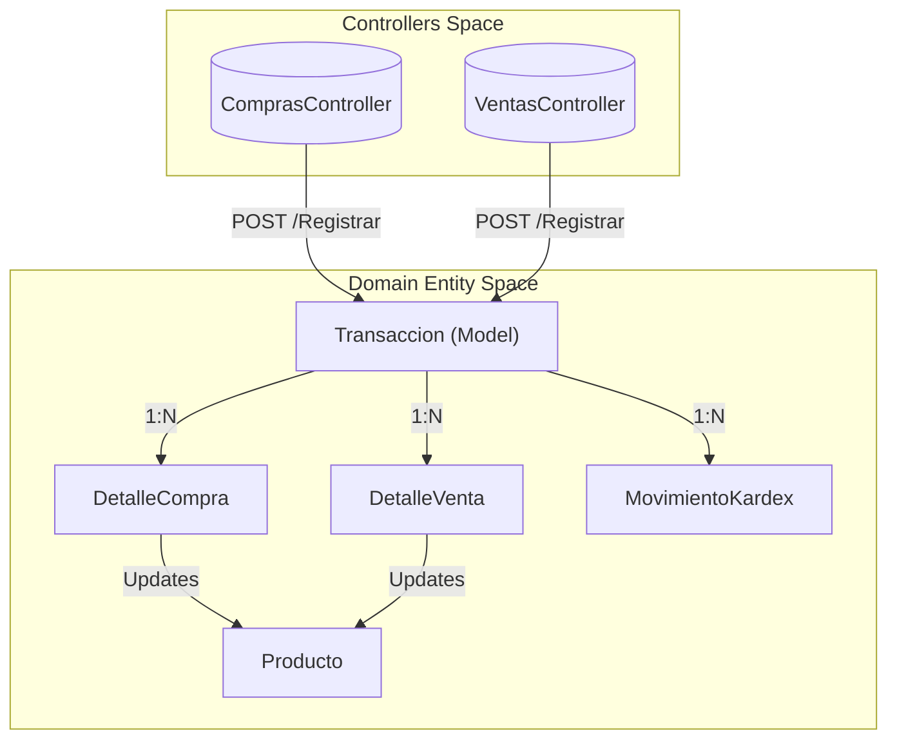
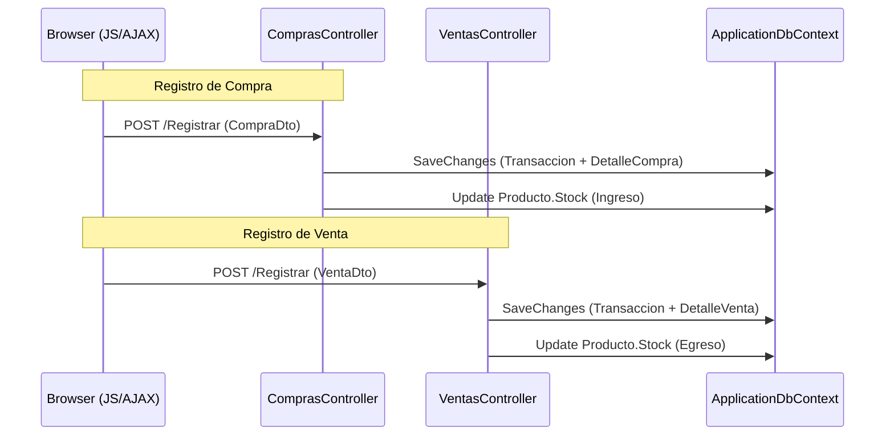

# Módulos de Negocio: Compras y Ventas (POS)

# Módulos de Negocio: Compras y Ventas (POS)

Relevant source files

The following files were used as context for generating this wiki page:

- [Controllers/ComprasController.cs](Controllers/ComprasController.cs)
- [Controllers/VentasController.cs](Controllers/VentasController.cs)
- [Models/Transaccion.cs](Models/Transaccion.cs)

El sistema gestiona el ciclo de vida comercial a través de dos flujos principales: la adquisición de suministros (Compras) y la comercialización de productos (Ventas). Ambos procesos están integrados con el control de inventarios en tiempo real y el sistema de gestión de cartera (Cuentas por Cobrar/Pagar).

## Ciclo de Transacciones y Kárdex

Cada operación comercial se registra como una `Transaccion` [Models/Transaccion.cs:31-32](). El sistema utiliza una cabecera unificada que distingue el flujo mediante el enum `TipoTransaccion` [Models/Transaccion.cs:9-13](). 

Cuando se confirma una transacción:
1. Se actualiza el campo `Stock` en la entidad `Producto`.
2. Se genera un registro en `MovimientoKardex` para trazabilidad histórica.
3. Se calcula el impacto financiero (Subtotal, Impuestos, Total).
4. Se establece un `EstadoPagoTransaccion` [Models/Transaccion.cs:15-20]() que determina si la transacción alimenta el módulo de Pagos y Cartera.

### Diagrama: Flujo de Datos en Transacciones

El siguiente diagrama ilustra cómo los controladores de negocio interactúan con las entidades del dominio para persistir una operación.

Sources: [Controllers/ComprasController.cs:68-71](), [Controllers/VentasController.cs:80-83](), [Models/Transaccion.cs:78-83]()

## Módulo de Compras

El módulo de compras permite el ingreso de mercancía al sistema. A diferencia de las ventas, las compras se registran inicialmente con un `EstadoPago.Pendiente` [Controllers/ComprasController.cs:126](), lo que genera automáticamente una cuenta por pagar en el módulo de cartera.

*   **Ingreso de Stock:** Cada línea de la compra incrementa el `Stock` del producto [Controllers/ComprasController.cs:95]().
*   **Kárdex:** Se genera un movimiento de tipo `Ingreso` [Controllers/ComprasController.cs:110]().
*   **Impuestos:** El sistema recupera el porcentaje de impuesto asociado al producto para calcular el `TotalImpuesto` de la transacción [Controllers/ComprasController.cs:88-92]().

Para más información sobre el procesamiento de DTOs y lógica de impuestos, consulte el **[Módulo de Compras](#5.1)**.

Sources: [Controllers/ComprasController.cs:81-116](), [Controllers/ComprasController.cs:118-129]()

## Módulo de Ventas (Terminal POS)

El Terminal de Punto de Venta (POS) está diseñado para transacciones rápidas. A diferencia de las compras, el POS asume un pago inmediato, marcando la transacción como `EstadoPago.Pagado` [Controllers/VentasController.cs:140]().

*   **Validación de Disponibilidad:** Antes de procesar, el sistema verifica que el `Stock` sea suficiente [Controllers/VentasController.cs:99-100]().
*   **Egreso de Stock:** Se reduce el inventario físico [Controllers/VentasController.cs:110]() y se registra el movimiento en el Kárdex como `Egreso` [Controllers/VentasController.cs:125]().
*   **Documentos:** Permite la generación de vistas de impresión para `Ticket` y `Factura` [Controllers/VentasController.cs:163-189]().

Para detalles sobre la interfaz de búsqueda y validaciones de stock, consulte el **[Módulo de Ventas (Terminal POS)](#5.2)**.

Sources: [Controllers/VentasController.cs:94-131](), [Controllers/VentasController.cs:133-143]()

## Gestión de Pagos y Cartera

Este componente actúa como el puente financiero para las transacciones que no se liquidan inmediatamente. Centraliza la visibilidad de deudas (Compras Pendientes) y créditos (Ventas Pendientes, si aplicara).

*   **Saldos:** La entidad `Transaccion` mantiene un `SaldoPendiente` [Models/Transaccion.cs:62-64]().
*   **Abonos:** Los pagos parciales actualizan el estado de la transacción de `Pendiente` a `Parcial` y finalmente a `Pagado`.

Para detalles sobre la lógica de conciliación de saldos, consulte **[Gestión de Pagos y Cartera (Cuentas por Cobrar/Pagar)](#5.3)**.

### Diagrama: Mapeo de Acciones a Código

Este diagrama asocia las acciones de usuario con los métodos específicos en los controladores y los tipos de datos involucrados.

Sources: [Controllers/ComprasController.cs:71-148](), [Controllers/VentasController.cs:83-162]()

| Entidad | Rol en el Ciclo | Archivo de Referencia |
| :--- | :--- | :--- |
| `Transaccion` | Cabecera (Compra/Venta) | [Models/Transaccion.cs]() |
| `DetalleCompra` | Líneas de costo e impuestos | [Controllers/ComprasController.cs:97-104]() |
| `DetalleVenta` | Líneas de precio de venta | [Controllers/VentasController.cs:112-119]() |
| `MovimientoKardex` | Auditoría de movimientos de stock | [Controllers/ComprasController.cs:106-115]() |

---

