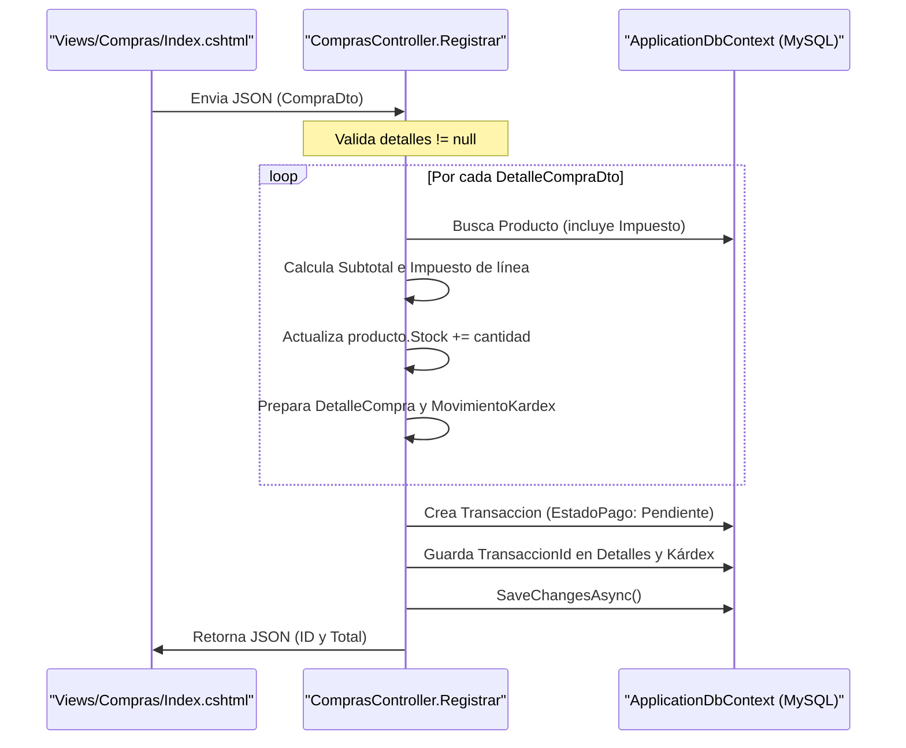

# Módulo de Compras


# Módulo de Compras

<details>
<summary>Relevant source files</summary>

The following files were used as context for generating this wiki page:

- [Controllers/ComprasController.cs](Controllers/ComprasController.cs)
- [Models/Compra.cs](Models/Compra.cs)
- [Models/MovimientoKardex.cs](Models/MovimientoKardex.cs)
- [Models/Transaccion.cs](Models/Transaccion.cs)
- [Views/Compras/Index.cshtml](Views/Compras/Index.cshtml)

</details>


El **Módulo de Compras** es el encargado de gestionar el abastecimiento de inventario mediante el registro de adquisiciones a proveedores. Este proceso no solo incrementa el stock físico de los productos, sino que también genera obligaciones financieras (cuentas por pagar) y mantiene la trazabilidad histórica de costos e impuestos a través del Kárdex.

## Flujo de Registro de Compra

El proceso se centraliza en el endpoint `POST /Compras/Registrar` [Controllers/ComprasController.cs:71](). Este endpoint recibe un objeto de transferencia de datos (DTO) que contiene la información del proveedor y el listado de productos adquiridos.

### Estructura de Datos (DTO)
Para la comunicación entre el cliente (JavaScript) y el servidor, se utilizan las siguientes clases:
*   **`CompraDto`**: Contiene el nombre del proveedor y una lista de detalles [Controllers/ComprasController.cs:152-156]().
*   **`DetalleCompraDto`**: Especifica el `ProductoId`, la `Cantidad` y el `PrecioCosto` pactado para esa transacción específica [Controllers/ComprasController.cs:158-163]().

### Diagrama de Secuencia: Registro de Compra
Este diagrama asocia las acciones del usuario en la interfaz con las entidades y métodos del controlador.


**Sources:** [Controllers/ComprasController.cs:71-148](), [Views/Compras/Index.cshtml:93-100]()

---

## Implementación Técnica

### 1. Cálculo de Impuestos y Totales
A diferencia de las ventas, donde el precio es fijo, en las compras el sistema calcula los impuestos basados en el `PrecioCosto` proporcionado en el DTO y el porcentaje de impuesto asociado actualmente al producto en la base de datos [Controllers/ComprasController.cs:83-89]().

*   **Subtotal de Línea**: `Cantidad * PrecioCosto` [Controllers/ComprasController.cs:87]().
*   **Impuesto de Línea**: `SubtotalLinea * (Producto.Impuesto.Porcentaje / 100)` [Controllers/ComprasController.cs:89]().
*   **Total Transacción**: Sumatoria de subtotales + sumatoria de impuestos [Controllers/ComprasController.cs:125]().

### 2. Actualización de Inventario y Kárdex
Por cada ítem procesado, el sistema realiza dos acciones críticas de persistencia:
1.  **Aumento de Stock**: Se modifica la propiedad `Stock` del modelo `Producto` directamente [Controllers/ComprasController.cs:95]().
2.  **Registro en Kárdex**: Se crea un objeto `MovimientoKardex` con `TipoMovimientoKardex.Ingreso` [Controllers/ComprasController.cs:110](), guardando el saldo resultante para auditoría [Controllers/ComprasController.cs:112]().

### 3. Gestión de Cartera (Cuentas por Pagar)
Toda compra registrada a través de este módulo se inicializa con un estado de deuda:
*   **`EstadoPago`**: Se establece como `EstadoPagoTransaccion.Pendiente` [Controllers/ComprasController.cs:126]().
*   **`SaldoPendiente`**: Se iguala al `Total` de la transacción [Controllers/ComprasController.cs:127]().
*   **`Tipo`**: Se marca como `TipoTransaccion.Compra` [Controllers/ComprasController.cs:120]().

**Sources:** [Models/Transaccion.cs:9-20](), [Models/MovimientoKardex.cs:9-13](), [Controllers/ComprasController.cs:118-129]()

---

## Mapeo de Entidades y Base de Datos

El siguiente diagrama muestra cómo el `ComprasController` orquesta la creación de múltiples registros en diferentes tablas de la base de datos a partir de una única petición.

```mermaid
classDiagram
    class "ComprasController" {
        +Registrar(CompraDto)
    }
    class "Transaccion (Table: transacciones)" {
        +int Id
        +TipoTransaccion Tipo (Compra)
        +EstadoPagoTransaccion EstadoPago (Pendiente)
        +decimal Total
        +decimal SaldoPendiente
    }
    class "DetalleCompra (Table: detalle_compras)" {
        +int TransaccionId
        +int ProductoId
        +decimal PrecioCosto
        +decimal MontoImpuesto
    }
    class "MovimientoKardex (Table: movimientos_kardex)" {
        +int ProductoId
        +int TransaccionId
        +TipoMovimientoKardex Tipo (Ingreso)
        +int Cantidad
    }

    "ComprasController" ..> "Transaccion" : Crea 1
    "Transaccion" "1" *-- "many" "DetalleCompra" : Posee
    "Transaccion" "1" -- "many" "MovimientoKardex" : Genera
```
**Sources:** [Models/Transaccion.cs:31-84](), [Models/Compra.cs:12-44](), [Models/MovimientoKardex.cs:15-69]()

## Seguridad y Permisos
El acceso a las funciones de este módulo está restringido mediante el atributo `[RequirePermission]`:
*   **Visualización**: El método `Index` y los de obtención de datos requieren el permiso `compras.ver` [Controllers/ComprasController.cs:21,30,50]().
*   **Registro**: La acción de guardar requiere el permiso `compras.registrar` [Controllers/ComprasController.cs:70]().

Toda transacción queda vinculada al usuario que la realizó mediante la extensión `User.UserId()` [Controllers/ComprasController.cs:114,128]().

**Sources:** [Controllers/ComprasController.cs:14-15](), [Controllers/ComprasController.cs:114]()

---

