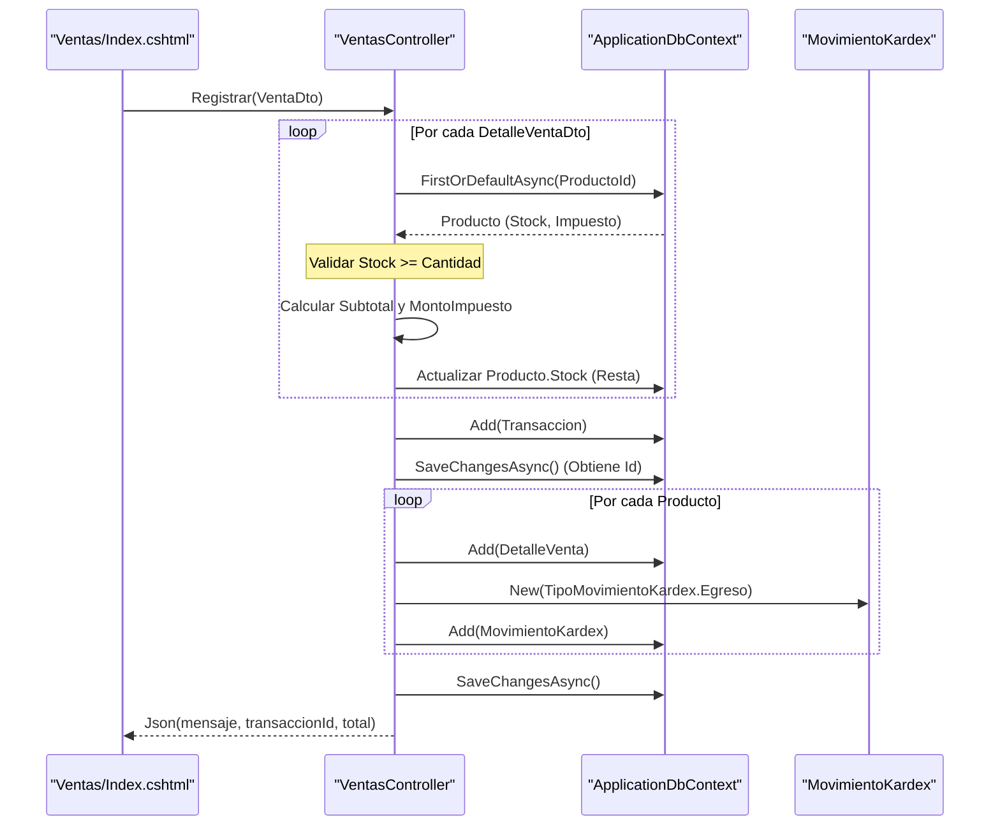
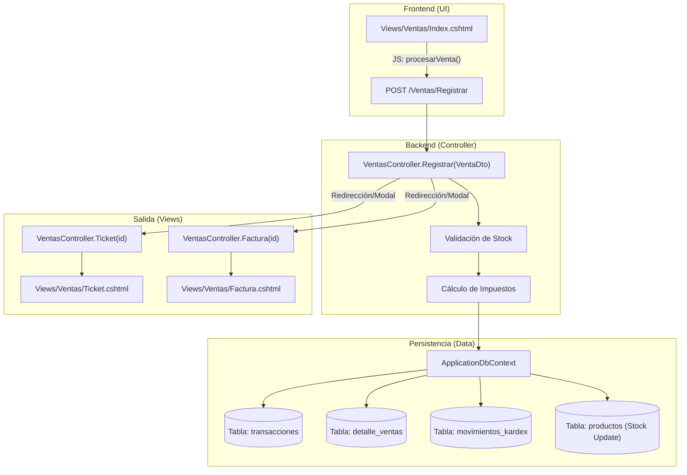

# Módulo de Ventas (Terminal POS)

# Módulo de Ventas (Terminal POS)

Relevant source files

The following files were used as context for generating this wiki page:

- [Controllers/VentasController.cs](Controllers/VentasController.cs)
- [Models/MovimientoKardex.cs](Models/MovimientoKardex.cs)
- [Models/Transaccion.cs](Models/Transaccion.cs)
- [Views/Ventas/Factura.cshtml](Views/Ventas/Factura.cshtml)
- [Views/Ventas/Index.cshtml](Views/Ventas/Index.cshtml)
- [Views/Ventas/Ticket.cshtml](Views/Ventas/Ticket.cshtml)

El Módulo de Ventas implementa una interfaz de Terminal de Punto de Venta (POS) diseñada para el registro ágil de transacciones de salida de mercancía. Este módulo integra la validación de inventario en tiempo real, el cálculo automático de impuestos por producto, la actualización del Kárdex y la generación de documentos comerciales (Tickets y Facturas).

## Implementación del VentasController

El controlador `VentasController` gestiona el ciclo de vida de una venta, desde la búsqueda de productos con stock disponible hasta la persistencia de la transacción y sus movimientos asociados.

### Flujo de Registro de Venta (`POST /Ventas/Registrar`)

El endpoint principal recibe un objeto `VentaDto` y realiza las siguientes operaciones en una transacción lógica:

1.  **Validación de Integridad**: Verifica que el carrito no esté vacío [Controllers/VentasController.cs:85-86]().
2.  **Validación de Stock**: Por cada producto en el DTO, consulta la base de datos para asegurar que la cantidad solicitada sea menor o igual al stock actual [Controllers/VentasController.cs:96-100]().
3.  **Cálculo Financiero**:
    *   Calcula el subtotal de línea (`cantidad * precio`).
    *   Aplica el porcentaje de impuesto asociado al producto para obtener el `montoImpuesto` [Controllers/VentasController.cs:102-104]().
    *   Acumula totales globales de subtotal e impuestos [Controllers/VentasController.cs:106-107]().
4.  **Actualización de Inventario**: Resta la cantidad vendida directamente del modelo `Producto` [Controllers/VentasController.cs:110]().
5.  **Persistencia de Transacción**:
    *   Crea una `Transaccion` con `TipoTransaccion.Venta` y `EstadoPagoTransaccion.Pagado` [Controllers/VentasController.cs:133-143]().
    *   Genera registros en `DetalleVenta` vinculados a la transacción [Controllers/VentasController.cs:112-119]().
    *   Genera registros en `MovimientoKardex` con tipo `Egreso` para trazabilidad [Controllers/VentasController.cs:121-130]().

### Diagrama de Secuencia: Registro de Venta

El siguiente diagrama detalla la interacción entre el cliente POS y las entidades del servidor durante el proceso de registro.

**Sources:** [Controllers/VentasController.cs:83-162](), [Models/Transaccion.cs:9-20](), [Models/MovimientoKardex.cs:9-13]()

## Estructura de Datos (DTOs y Modelos)

El intercambio de datos se simplifica mediante DTOs (Data Transfer Objects) para recibir la entrada del frontend, mientras que la persistencia utiliza modelos de dominio complejos.

### VentaDto y DetalleVentaDto
Ubicados en [Controllers/VentasController.cs:193-203](), definen la estructura mínima necesaria para procesar una venta desde el cliente:
*   `ProductoId`: Identificador único del producto.
*   `Cantidad`: Unidades a descargar.
*   `PrecioVenta`: Precio pactado en el momento de la transacción.

### Entidad Transacción
La venta se guarda en la tabla `transacciones` con los siguientes atributos clave:
| Atributo | Valor para Ventas | Descripción |
| :--- | :--- | :--- |
| `Tipo` | `TipoTransaccion.Venta` | Identifica el flujo como salida. |
| `EstadoPago` | `EstadoPagoTransaccion.Pagado` | El POS asume pago inmediato por defecto [Controllers/VentasController.cs:140](). |
| `SaldoPendiente` | `0` | Al estar pagada, no genera deuda en cartera. |
| `UsuarioId` | `User.UserId()` | ID del cajero que procesó la venta [Controllers/VentasController.cs:142](). |

**Sources:** [Models/Transaccion.cs:31-84](), [Controllers/VentasController.cs:133-143]()

## Generación de Documentos (Ticket y Factura)

El sistema provee dos vistas especializadas para la salida de documentos post-venta. Ambas reciben el modelo `Transaccion` cargado con sus relaciones `DetallesVenta` y `Producto`.

### Ticket (Formato Térmico)
*   **Archivo**: `Views/Ventas/Ticket.cshtml`
*   **Diseño**: Optimizado para impresoras térmicas de 80mm utilizando estilos CSS embebidos [Views/Ventas/Ticket.cshtml:17-19]().
*   **Comportamiento**: Ejecuta automáticamente el diálogo de impresión del navegador al cargar (`window.print()`) [Views/Ventas/Ticket.cshtml:89-91]().

### Factura (Formato A4)
*   **Archivo**: `Views/Ventas/Factura.cshtml`
*   **Diseño**: Utiliza Tailwind CSS para un formato profesional de página completa [Views/Ventas/Factura.cshtml:11-13]().
*   **Detalle**: Incluye desglose de IVA por línea y totales calculados de subtotal e impuestos globales [Views/Ventas/Factura.cshtml:71-103]().

**Sources:** [Views/Ventas/Ticket.cshtml:1-94](), [Views/Ventas/Factura.cshtml:1-111](), [Controllers/VentasController.cs:163-189]()

## Mapeo de Componentes de Código

Este diagrama asocia los procesos de negocio con las clases y métodos específicos en el código fuente.

**Sources:** [Controllers/VentasController.cs:1-190](), [Views/Ventas/Index.cshtml:96-102](), [Models/Transaccion.cs:30-31](), [Models/MovimientoKardex.cs:15-16]()

---

