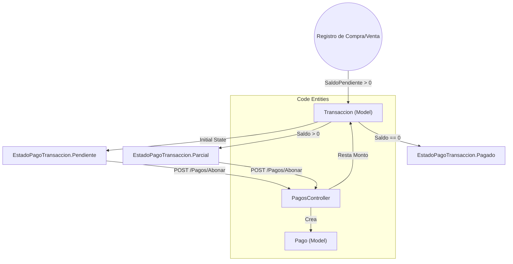
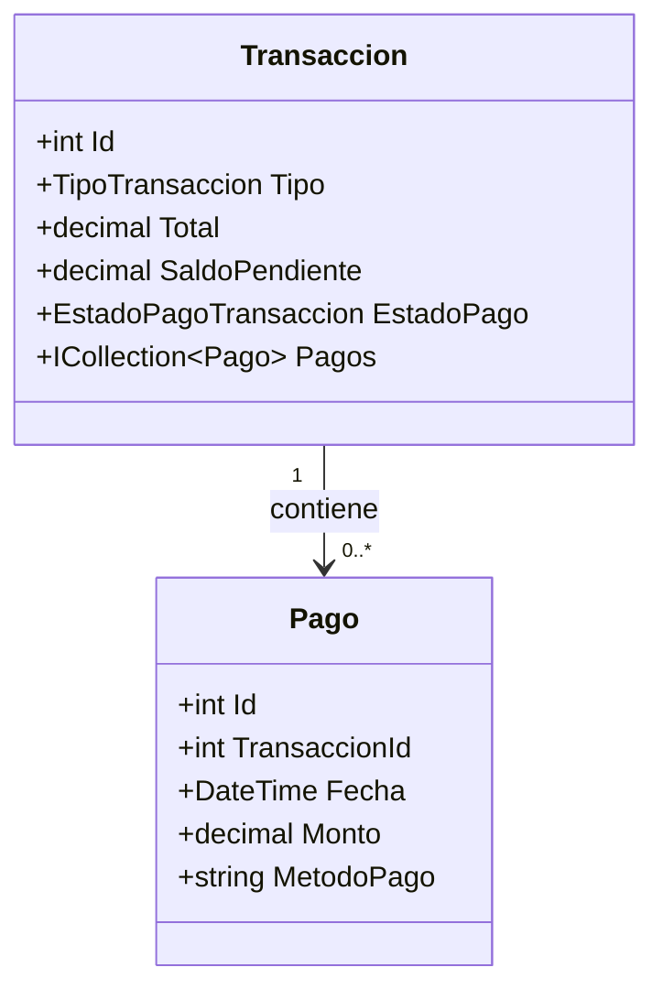

# Gestión de Pagos y Cartera (Cuentas por Cobrar/Pagar)

# Gestión de Pagos y Cartera (Cuentas por Cobrar/Pagar)

Relevant source files

The following files were used as context for generating this wiki page:

- [Controllers/PagosController.cs](Controllers/PagosController.cs)
- [Models/Pago.cs](Models/Pago.cs)
- [Models/Transaccion.cs](Models/Transaccion.cs)
- [Views/Pagos/Index.cshtml](Views/Pagos/Index.cshtml)

El módulo de **Gestión de Pagos** es el componente encargado de administrar el ciclo de vida financiero de las transacciones que no se liquidan de forma inmediata. Permite el seguimiento de cuentas por cobrar (ventas a crédito) y cuentas por pagar (compras a crédito), facilitando el registro de abonos parciales hasta la liquidación total de la deuda.

## Flujo Lógico de Cartera

El sistema utiliza la entidad `Transaccion` como eje central. Una transacción nace con un `EstadoPago` y un `SaldoPendiente` que determinan su visibilidad en el módulo de cartera.

### Estados de Pago y Transiciones
Las transacciones transicionan entre estados definidos en el enumerador `EstadoPagoTransaccion` [Models/Transaccion.cs:15-20]():

1.  **Pendiente**: La transacción se registró pero no ha recibido ningún abono. El `SaldoPendiente` es igual al `Total`.
2.  **Parcial**: Se ha registrado al menos un pago, pero el `SaldoPendiente` es mayor a cero.
3.  **Pagado**: El `SaldoPendiente` es cero. La transacción sale de la vista de cartera activa.

**Diagrama de Transición de Estados y Datos**

*Sources: [Models/Transaccion.cs:15-20](), [Controllers/PagosController.cs:58-99]()*

## Implementación del PagosController

El `PagosController` gestiona la visualización y la lógica de negocio para la reducción de saldos.

### Visualización de Cartera Activa
El método `Index` filtra exclusivamente aquellas transacciones que requieren atención financiera, ordenándolas por antigüedad para priorizar cobros/pagos pendientes [Controllers/PagosController.cs:20-29]().

| Acción | Endpoint | Descripción |
| :--- | :--- | :--- |
| **Listar** | `GET /Pagos` | Recupera transacciones con estado `Pendiente` o `Parcial` [Controllers/PagosController.cs:23-24](). |
| **Inspeccionar** | `GET /Pagos/DetalleTransaccion/{id}` | Devuelve un JSON con el historial de abonos vinculados (`Include(t => t.Pagos)`) [Controllers/PagosController.cs:33-55](). |
| **Registrar** | `POST /Pagos/Abonar` | Procesa un `AbonoDto` para actualizar el saldo y estado [Controllers/PagosController.cs:59-99](). |

### Lógica de Abono (Endpoint POST)
El método `Abonar` realiza validaciones críticas antes de persistir cambios:
1.  **Validación de Monto**: El abono debe ser mayor a cero y no puede exceder el `SaldoPendiente` actual [Controllers/PagosController.cs:61-72]().
2.  **Persistencia del Pago**: Se crea una instancia de la clase `Pago` asociada a la `TransaccionId` [Controllers/PagosController.cs:75-82]().
3.  **Cálculo de Saldo**: Se resta el monto del abono al `SaldoPendiente` de la transacción [Controllers/PagosController.cs:85]().
4.  **Actualización Automática de Estado**: Si el saldo llega a cero, el estado cambia a `Pagado`; de lo contrario, se marca como `Parcial` [Controllers/PagosController.cs:87-90]().

*Sources: [Controllers/PagosController.cs:1-108]()*

## Modelos de Datos Relacionados

La relación entre transacciones y sus pagos es de uno a muchos (1:N), permitiendo que una factura sea liquidada en múltiples cuotas.

### Clase Pago
Representa un ingreso o egreso de efectivo aplicado a una deuda específica.

*Sources: [Models/Transaccion.cs:31-84](), [Models/Pago.cs:9-47]()*

## Interfaz de Usuario: Inspector Contable

La vista `Pagos/Index.cshtml` utiliza un patrón de "Maestro-Detalle" en una sola pantalla para agilizar la operación.

1.  **Tabla de Cartera**: Muestra el ID, Sujeto (Proveedor/Cliente), Total y Saldo Pendiente. Las filas tienen un evento `onclick` que dispara la función JavaScript `verDetalles(id)` [Views/Pagos/Index.cshtml:35-59]().
2.  **Inspector Contable (Sidebar)**: Un panel dinámico que carga vía AJAX el historial de pagos de la transacción seleccionada, permitiendo auditar cuándo y cómo se han realizado los abonos previos [Views/Pagos/Index.cshtml:70-97]().
3.  **Modal de Abono**: Utiliza `SweetAlert2` para capturar el monto y el método de pago, enviando los datos al servidor mediante un `fetch` al endpoint `/Pagos/Abonar` [Views/Pagos/Index.cshtml:125-133]().

### Diferenciación Visual
En la interfaz, las transacciones se distinguen por color según su origen:
*   **Ventas**: Marcadas con texto `text-emerald-500` (Cuentas por Cobrar) [Views/Pagos/Index.cshtml:40]().
*   **Compras**: Marcadas con texto `text-amber-500` (Cuentas por Pagar) [Views/Pagos/Index.cshtml:40]().

*Sources: [Views/Pagos/Index.cshtml:1-133]()*

---

