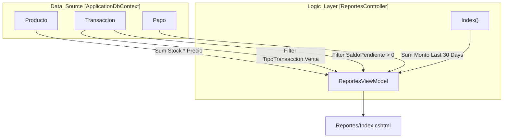
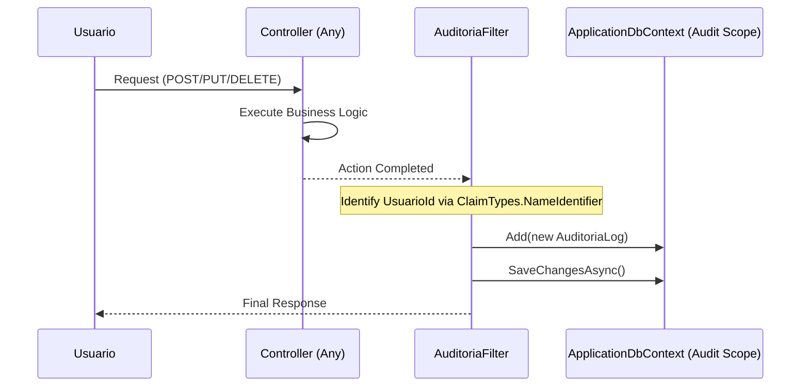

# Reportes, Auditoría y Monitoreo

# Reportes, Auditoría y Monitoreo

Relevant source files

The following files were used as context for generating this wiki page:

- [Controllers/AuditoriaController.cs](Controllers/AuditoriaController.cs)
- [Controllers/ReportesController.cs](Controllers/ReportesController.cs)
- [Filters/AuditoriaFilter.cs](Filters/AuditoriaFilter.cs)
- [Models/AuditoriaLog.cs](Models/AuditoriaLog.cs)

Esta sección describe los mecanismos de inteligencia de negocio y trazabilidad del sistema InventarioApp. El sistema separa la visualización de indicadores clave (KPIs) y estados financieros de la infraestructura de registro de actividad de usuarios, garantizando tanto la toma de decisiones basada en datos como la integridad operativa.

### Propósito y Alcance
El módulo de monitoreo se divide en dos pilares fundamentales:
1.  **Inteligencia de Negocio**: Consolidación de datos transaccionales para reportes de inventario, fiscalidad y cartera.
2.  **Trazabilidad Operativa**: Registro automático de acciones que modifican el estado del sistema para auditorías posteriores.

---

### Dashboard y Reportes de Negocio

El sistema ofrece una visión consolidada de la salud financiera y operativa a través de `ReportesController` [Controllers/ReportesController.cs:13-14](). Este componente utiliza el `ReportesViewModel` [Controllers/ReportesController.cs:61-81]() para centralizar métricas calculadas en tiempo real desde la base de datos.

Los reportes cubren cuatro áreas críticas:
*   **Valorización de Inventario**: Cálculo del valor total de activos basado en `Stock * Precio` [Controllers/ReportesController.cs:24]().
*   **Gestión Fiscal**: Seguimiento de IVA por pagar (ventas) y descontable (compras) de los últimos 30 días [Controllers/ReportesController.cs:35-37]().
*   **Cartera y Liquidez**: Monitoreo de `SaldoPendiente` para cuentas por cobrar/pagar y flujo de caja real mediante el registro de `Pagos` [Controllers/ReportesController.cs:40-55]().

Para un desglose detallado de los cálculos y la interfaz del panel de control, consulte:
**[Dashboard y Reportes de Negocio](#6.1)**

**Diagrama: Flujo de Consolidación de Reportes**

**Sources:** [Controllers/ReportesController.cs:18-59](), [Controllers/ReportesController.cs:61-81]()

---

### Sistema de Auditoría Global

La trazabilidad en InventarioApp es pasiva y automática. Se implementa mediante el `AuditoriaFilter` [Filters/AuditoriaFilter.cs:16](), un filtro global de tipo `IAsyncActionFilter` que intercepta todas las peticiones que realizan cambios en el sistema.

*   **Interceptación Selectiva**: El filtro solo actúa sobre métodos `POST`, `PUT` y `DELETE` [Filters/AuditoriaFilter.cs:32](), ignorando operaciones de lectura para optimizar el rendimiento.
*   **Aislamiento de Transacciones**: Para evitar efectos secundarios en las operaciones de negocio, el filtro utiliza un `IServiceScope` propio para instanciar un `ApplicationDbContext` independiente [Filters/AuditoriaFilter.cs:59-60]().
*   **Modelo de Datos**: Cada evento se almacena en la tabla `auditoria_logs` mediante la clase `AuditoriaLog` [Models/AuditoriaLog.cs:10](), registrando el usuario, el módulo, la acción técnica y la dirección IP [Models/AuditoriaLog.cs:13-42]().

Para detalles sobre la implementación técnica del filtro y la visualización de bitácoras, consulte:
**[Sistema de Auditoría Global](#6.2)**

**Diagrama: Interceptación de Auditoría**

**Sources:** [Filters/AuditoriaFilter.cs:25-73](), [Models/AuditoriaLog.cs:9-42]()

---

### Relación entre Componentes de Monitoreo

| Componente | Responsabilidad | Entidad Principal | Frecuencia |
| :--- | :--- | :--- | :--- |
| **ReportesController** | Análisis de rendimiento y finanzas. | `Transaccion`, `Pago` | Bajo demanda (Pull) |
| **AuditoriaFilter** | Seguridad y trazabilidad de cambios. | `AuditoriaLog` | Automático (Push) |
| **AuditoriaController** | Visualización de bitácoras para admin. | `AuditoriaLog` | Bajo demanda (Pull) |

**Sources:** [Controllers/ReportesController.cs:13-15](), [Filters/AuditoriaFilter.cs:16-17](), [Controllers/AuditoriaController.cs:14-15]()

---

