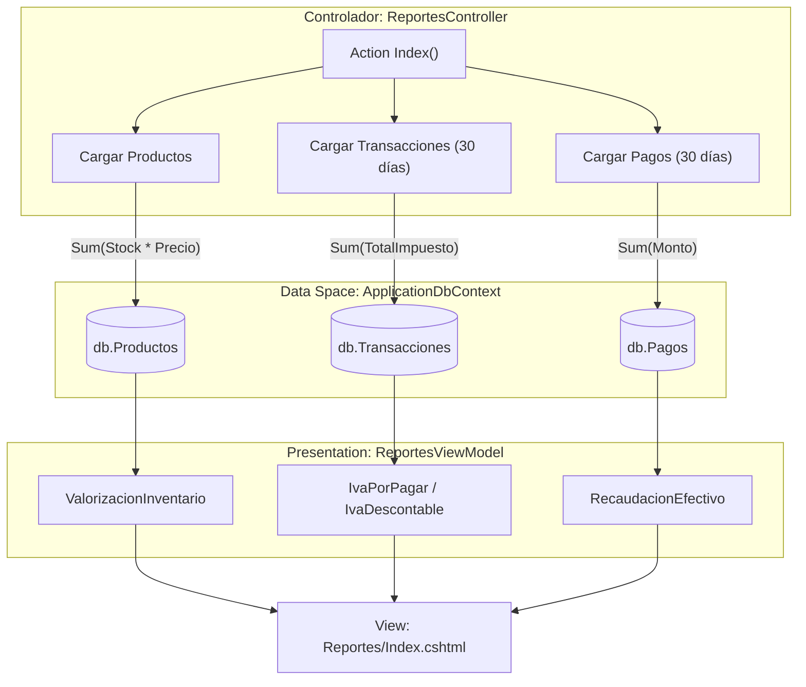
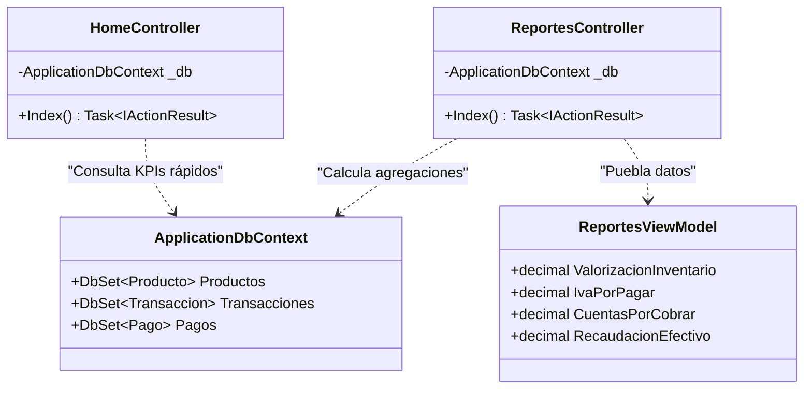

# Dashboard y Reportes de Negocio

# Dashboard y Reportes de Negocio

Relevant source files

The following files were used as context for generating this wiki page:

- [Controllers/HomeController.cs](Controllers/HomeController.cs)
- [Controllers/ReportesController.cs](Controllers/ReportesController.cs)
- [Views/Home/Index.cshtml](Views/Home/Index.cshtml)
- [Views/Reportes/Index.cshtml](Views/Reportes/Index.cshtml)
- [Views/_ViewImports.cshtml](Views/_ViewImports.cshtml)

Este módulo proporciona la capa de inteligencia de negocio y visualización de datos del sistema. Se divide en dos componentes principales: el `HomeController`, encargado de mostrar indicadores clave de rendimiento (KPIs) en tiempo real, y el `ReportesController`, que consolida métricas financieras, fiscales y de inventario para la toma de decisiones.

## Dashboard Principal (HomeController)

El `HomeController` actúa como el punto de entrada principal para los usuarios autenticados. Su función es realizar consultas rápidas de agregación sobre el `ApplicationDbContext` para presentar el estado actual de la operación.

### Implementación y Flujo de Datos
El método `Index` recupera cuatro métricas fundamentales mediante consultas asíncronas a la base de datos:
1.  **Total Productos**: Conteo total de registros en la tabla `Productos`.
2.  **Total Categorías**: Conteo total de registros en la tabla `Categorias`.
3.  **Stock Bajo**: Conteo de productos cuya propiedad `Stock` es inferior a 5 unidades.
4.  **Ventas Realizadas**: Conteo de transacciones filtradas por `TipoTransaccion.Venta`.

Mapeo de Datos en el Dashboard:
| Indicador | Origen de Datos (LINQ) | Archivo de Referencia |
| :--- | :--- | :--- |
| Total Productos | `_db.Productos.CountAsync()` | [Controllers/HomeController.cs:20-20]() |
| Categorías | `_db.Categorias.CountAsync()` | [Controllers/HomeController.cs:21-21]() |
| Stock Bajo | `_db.Productos.CountAsync(p => p.Stock < 5)` | [Controllers/HomeController.cs:22-22]() |
| Ventas | `_db.Transacciones.CountAsync(t => t.Tipo == TipoTransaccion.Venta)` | [Controllers/HomeController.cs:23-24]() |

### Interfaz de Usuario
La vista `Views/Home/Index.cshtml` utiliza **Tailwind CSS** para renderizar tarjetas interactivas. Si el contador de `StockBajo` es mayor a cero, se activa una alerta visual (`pulse-alert`) y un anillo rojo en la tarjeta correspondiente para captar la atención del usuario [Views/Home/Index.cshtml:38-41]().

**Sources:**
- [Controllers/HomeController.cs:13-26]()
- [Views/Home/Index.cshtml:5-90]()

---

## Centro de Inteligencia de Negocios (ReportesController)

El `ReportesController` gestiona el modelo `ReportesViewModel`, el cual agrupa datos complejos que requieren cálculos de sumatoria y filtrado por rangos de tiempo (últimos 30 días).

### Análisis de Áreas Funcionales

#### 1. Valorización de Inventario
Calcula el valor monetario total de la bodega multiplicando el stock físico por el precio de venta de cada producto [Controllers/ReportesController.cs:23-24]().
- **Entidad**: `Producto`.
- **Propiedades**: `Stock`, `Precio`.

#### 2. Informe Fiscal (IVA)
Segmenta las transacciones de los últimos 30 días para calcular la responsabilidad tributaria [Controllers/ReportesController.cs:29-37]().
- **IVA por Pagar**: Suma de `TotalImpuesto` en transacciones de tipo `Venta`.
- **IVA Descontable**: Suma de `TotalImpuesto` en transacciones de tipo `Compra`.

#### 3. Cartera (Cuentas por Cobrar/Pagar)
Monitorea la deuda pendiente de clientes y la deuda propia con proveedores consultando el `SaldoPendiente` de las transacciones que no han sido liquidadas totalmente [Controllers/ReportesController.cs:40-46]().

#### 4. Liquidez y Recaudación
Mide el flujo de caja real basándose en la tabla `Pagos`. A diferencia de las ventas (que pueden ser a crédito), este indicador solo suma el dinero efectivamente ingresado o egresado en los últimos 30 días [Controllers/ReportesController.cs:49-55]().

### Diagrama de Flujo: Generación de Reportes

El siguiente diagrama describe cómo el `ReportesController` interactúa con el `ApplicationDbContext` para poblar el `ReportesViewModel`.

Mapeo de Lógica a Entidades:

**Sources:**
- [Controllers/ReportesController.cs:18-59]()
- [Controllers/ReportesController.cs:61-81]()

---

## Estructura del Modelo de Reportes

El `ReportesViewModel` centraliza los datos calculados para evitar lógica compleja dentro de la vista.

| Propiedad | Tipo | Descripción |
| :--- | :--- | :--- |
| `ValorizacionInventario` | `decimal` | Valor total de activos en bodega. |
| `VentasTotalesBrutas` | `decimal` | Ingresos totales por ventas (incluyendo IVA). |
| `IvaPorPagar` | `decimal` | Impuesto recolectado en ventas. |
| `CuentasPorCobrar` | `decimal` | Saldo pendiente de transacciones tipo Venta. |
| `RecaudacionEfectivo` | `decimal` | Monto total de pagos recibidos en efectivo. |

### Visualización y Salida
La vista `Views/Reportes/Index.cshtml` organiza estos datos en cuatro módulos cromáticos:
- **Indigo**: Análisis de Stock.
- **Dark/Emerald**: Contabilidad e IVA (Ventas Netas).
- **White/Red**: Cartera y Deudas.
- **Purple/Indigo**: Liquidez Real.

Además, incluye una función de impresión optimizada mediante CSS `@media print`, que oculta elementos de navegación y botones para generar un balance limpio en papel o PDF [Views/Reportes/Index.cshtml:89-98]().

**Sources:**
- [Controllers/ReportesController.cs:61-81]()
- [Views/Reportes/Index.cshtml:11-66]()

---

## Trazabilidad y Auditoría
Desde el centro de reportes, el sistema enlaza directamente con el `AuditoriaController` [Views/Reportes/Index.cshtml:74](). Esto permite que el administrador, tras observar una anomalía en los KPIs o reportes financieros, pueda investigar cambios manuales en el Kárdex o ediciones de transacciones mediante el visor global de logs.

### Asociación de Entidades y Controladores

**Sources:**
- [Controllers/HomeController.cs:13-16]()
- [Controllers/ReportesController.cs:13-16]()
- [Controllers/ReportesController.cs:61-81]()

---

