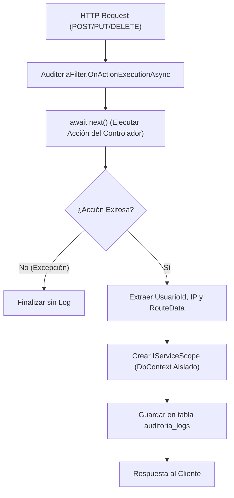
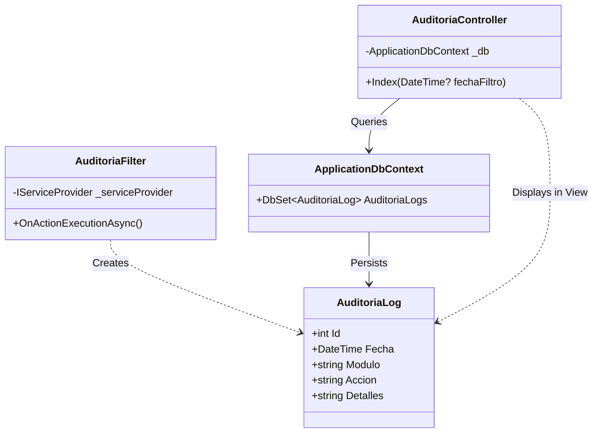

# Sistema de Auditoría Global

# Sistema de Auditoría Global

Relevant source files

The following files were used as context for generating this wiki page:

- [Controllers/AuditoriaController.cs](Controllers/AuditoriaController.cs)
- [Filters/AuditoriaFilter.cs](Filters/AuditoriaFilter.cs)
- [Models/AuditoriaLog.cs](Models/AuditoriaLog.cs)
- [Program.cs](Program.cs)
- [Views/Auditoria/Index.cshtml](Views/Auditoria/Index.cshtml)

El Sistema de Auditoría Global de **InventarioApp** proporciona una capa de trazabilidad automática para todas las operaciones que modifican el estado del sistema. Utiliza un filtro de acción asíncrono global que intercepta las peticiones HTTP de escritura, registrando quién, cuándo y qué acción se realizó, garantizando la integridad y el monitoreo de los cambios en el ERP.

## Arquitectura del Sistema de Auditoría

El sistema se basa en tres componentes principales: un filtro global (`AuditoriaFilter`), un modelo de persistencia (`AuditoriaLog`) y una interfaz de visualización (`AuditoriaController`).

### Flujo de Intercepción de Datos

El `AuditoriaFilter` actúa como un middleware de nivel de aplicación que observa el flujo de ejecución de los controladores.

Título: Flujo de Intercepción del AuditoriaFilter

**Fuentes:**
- [Filters/AuditoriaFilter.cs:16-33]() para la lógica de filtrado por método HTTP.
- [Filters/AuditoriaFilter.cs:36-37]() para la validación de excepciones antes de auditar.
- [Filters/AuditoriaFilter.cs:59-60]() para el uso de un scope aislado de base de datos.

---

## Implementación Técnica

### El Modelo AuditoriaLog
La entidad `AuditoriaLog` representa un registro único en la tabla `auditoria_logs`. Está diseñada para capturar el contexto completo de la transacción sin interferir con la lógica de negocio.

| Propiedad | Tipo | Descripción | Mapeo DB |
| :--- | :--- | :--- | :--- |
| `Id` | `int` | Clave primaria autoincremental. | `Id` |
| `Fecha` | `DateTime` | Marca de tiempo de la operación. | `fecha` |
| `UsuarioId` | `int?` | ID del usuario que realizó la acción (nullable para acciones anónimas). | `usuario_id` |
| `Modulo` | `string` | Nombre del controlador interceptado. | `modulo` |
| `Accion` | `string` | Método HTTP + Nombre de la acción (ej. `POST - Registrar`). | `accion` |
| `Detalles` | `string` | Descripción textual generada de la interacción. | `detalles` |
| `DireccionIp` | `string?` | Dirección IP de origen de la solicitud. | `direccion_ip` |

**Fuentes:**
- [Models/AuditoriaLog.cs:9-42]() definición de la clase y atributos de mapeo.

### AuditoriaFilter: El Motor de Rastreo
El filtro se registra globalmente en `Program.cs` y se inyecta en el pipeline de MVC. Una característica crítica es que utiliza su propio `IServiceScope` para obtener una instancia de `ApplicationDbContext` independiente de la del controlador, evitando conflictos de seguimiento de entidades (Change Tracker) si la transacción principal falla o se confirma.

- **Registro Global:** Se añade mediante `options.Filters.AddService<AuditoriaFilter>()` [Program.cs:31-32]().
- **Exclusiones:** El filtro ignora explícitamente el controlador de `Login` para evitar el registro masivo de intentos de acceso [Filters/AuditoriaFilter.cs:41]().
- **Extracción de Identidad:** Obtiene el ID del usuario desde los Claims del `HttpContext` [Filters/AuditoriaFilter.cs:46-51]().

**Fuentes:**
- [Program.cs:26-32]() registro del servicio y el filtro global.
- [Filters/AuditoriaFilter.cs:16-81]() implementación de `IAsyncActionFilter`.

---

## Visualización y Consulta

### AuditoriaController
El acceso a los logs está restringido mediante el atributo `[RequirePermission("auditoria.ver")]` [AuditoriaController.cs:13](). El controlador permite filtrar los registros por una fecha específica.

- **Limitación de Carga:** Para prevenir problemas de rendimiento, el método `Index` limita la consulta a los últimos 500 registros ordenados por fecha descendente [AuditoriaController.cs:33]().
- **Eager Loading:** Se utiliza `.Include(a => a.Usuario)` para mostrar el nombre del responsable en la vista [AuditoriaController.cs:25]().

### Interfaz de Usuario (Vista)
La vista utiliza Tailwind CSS para presentar una tabla de trazas. Cada fila muestra la fecha/hora, el usuario (o "Sistema/Desconocido" si no hay sesión), el módulo con un badge visual y la acción técnica ejecutada.

Título: Relación entre Componentes de Auditoría

**Fuentes:**
- [Controllers/AuditoriaController.cs:14-38]() lógica del controlador.
- [Views/Auditoria/Index.cshtml:23-64]() estructura de la tabla de auditoría.
- [Views/Auditoria/Index.cshtml:12-19]() formulario de filtrado por fecha.

---

## Resumen de Flujo de Datos

1.  **Captura:** El usuario envía una petición `POST` para crear un producto.
2.  **Procesamiento:** El controlador de productos guarda el registro.
3.  **Auditoría:** `AuditoriaFilter` detecta el éxito de la operación, extrae el `ClaimTypes.NameIdentifier` del usuario y la IP.
4.  **Persistencia:** Se inserta una fila en `auditoria_logs` con el módulo "Productos" y la acción "POST - Guardar".
5.  **Consulta:** Un administrador accede a `/Auditoria` y visualiza la traza generada.

**Fuentes:**
- [Filters/AuditoriaFilter.cs:62-73]() creación y guardado del log.
- [Controllers/AuditoriaController.cs:23-37]() recuperación de datos para la vista.

---

