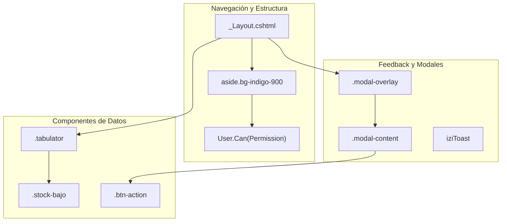
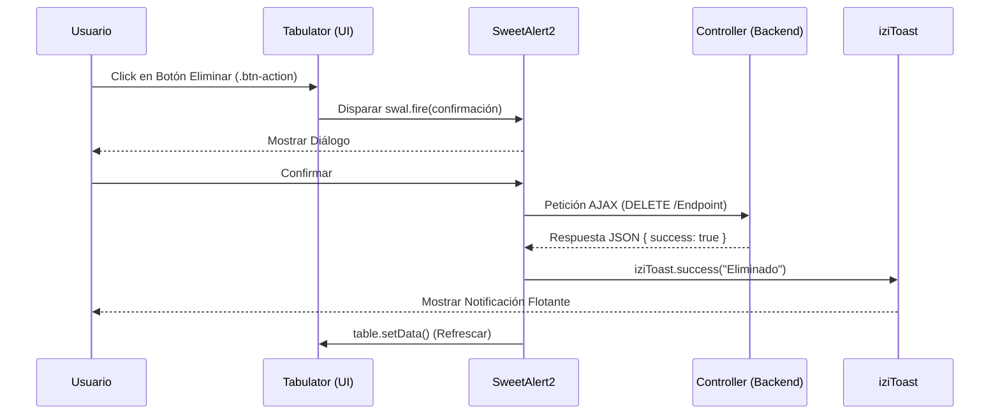

# Interfaz de Usuario y Componentes Frontend

# Interfaz de Usuario y Componentes Frontend

Relevant source files

The following files were used as context for generating this wiki page:

- [Views/Shared/_Layout.cshtml](Views/Shared/_Layout.cshtml)
- [Views/Shared/_ValidationScriptsPartial.cshtml](Views/Shared/_ValidationScriptsPartial.cshtml)

Esta sección describe la capa de presentación de **InventarioApp**, la cual utiliza un enfoque moderno basado en **ASP.NET Core MVC** enriquecido con librerías de cliente para proporcionar una experiencia de usuario fluida, responsiva y altamente interactiva. La interfaz se centra en la eficiencia operativa, utilizando tablas dinámicas, modales animados y notificaciones en tiempo real.

## Arquitectura de la Capa de Presentación

La interfaz está construida sobre una base de **Tailwind CSS** para el diseño visual, utilizando un sistema de componentes reutilizables definidos en el layout principal y scripts compartidos.

### Stack Tecnológico Frontend

| Librería | Propósito | Implementación |
| :--- | :--- | :--- |
| **Tailwind CSS** | Estilizado base y diseño responsivo. | Cargado vía CDN en `_Layout.cshtml` [Views/Shared/_Layout.cshtml:9-9](). |
| **Tabulator** | Visualización de datos, paginación y filtrado. | Estilos personalizados para integración visual [Views/Shared/_Layout.cshtml:56-127](). |
| **SweetAlert2** | Diálogos de confirmación y alertas críticas. | Configuración global para prompts de eliminación [Views/Shared/_Layout.cshtml:13-13](). |
| **iziToast** | Notificaciones flotantes (Toasts). | Usado para feedback de operaciones CRUD [Views/Shared/_Layout.cshtml:15-15](). |
| **Animate.css** | Animaciones de transición y estados. | Aplicado a modales y carga de contenido [Views/Shared/_Layout.cshtml:17-17](). |

### Relación entre Componentes UI y Código

El siguiente diagrama ilustra cómo las definiciones en los archivos de vista se traducen en componentes visuales y cómo interactúan con las librerías externas.

**Mapeo de Entidades UI a Código**

*Sources: [Views/Shared/_Layout.cshtml:22-189](), [Views/Shared/_Layout.cshtml:193-205]()*

## Componentes Clave de la Interfaz

### 1. Layout Compartido y Navegación
El archivo `_Layout.cshtml` actúa como el contenedor global de la aplicación. Gestiona la autenticación del lado del cliente para mostrar u ocultar el menú lateral (Sidebar) y la barra superior (Topbar). La navegación es dinámica y se basa en los permisos del usuario actual mediante el método de extensión `User.Can()`.

Para detalles sobre la estructura del layout y la lógica de navegación, consulte **[Layout Compartido y Navegación](#7.1)**.

### 2. Patrones de Tablas (Tabulator)
El sistema utiliza **Tabulator** para todas las grillas de datos. Se han definido estilos CSS globales para que estas tablas tengan un aspecto profesional, con encabezados en degradado y efectos de hover en las filas [Views/Shared/_Layout.cshtml:63-89](). Además, se incluye lógica visual para resaltar productos con stock bajo [Views/Shared/_Layout.cshtml:135-141]().

### 3. Sistema de Modales y Animaciones
En lugar de redirecciones constantes, el sistema prefiere el uso de modales para operaciones de creación y edición. Estos modales cuentan con animaciones de entrada y salida (escala y opacidad) definidas mediante transiciones CSS para mejorar la percepción de velocidad [Views/Shared/_Layout.cshtml:34-51]().

### 4. Notificaciones y Validaciones
La aplicación emplea un sistema dual de validación:
- **Lado Cliente:** Mediante `jquery.validate.unobtrusive` para feedback inmediato en formularios [Views/Shared/_ValidationScriptsPartial.cshtml:1-2]().
- **Feedback de Servidor:** Las respuestas de los controladores se comunican al usuario mediante `iziToast` para éxitos/errores y `SweetAlert2` para confirmaciones destructivas.

Para detalles sobre la implementación de tablas, modales y alertas, consulte **[Patrones de UI: Tablas, Modales y Notificaciones](#7.2)**.

## Flujo de Interacción UI

El siguiente diagrama describe cómo un usuario interactúa con los componentes frontend para realizar una acción (ej. Eliminar un producto).

**Flujo de Interacción: Eliminación de Registro**

*Sources: [Views/Shared/_Layout.cshtml:146-155](), [Views/Shared/_Layout.cshtml:56-62]()*

---
**Páginas Hijas:**
- [Layout Compartido y Navegación](#7.1)
- [Patrones de UI: Tablas, Modales y Notificaciones](#7.2)

---

