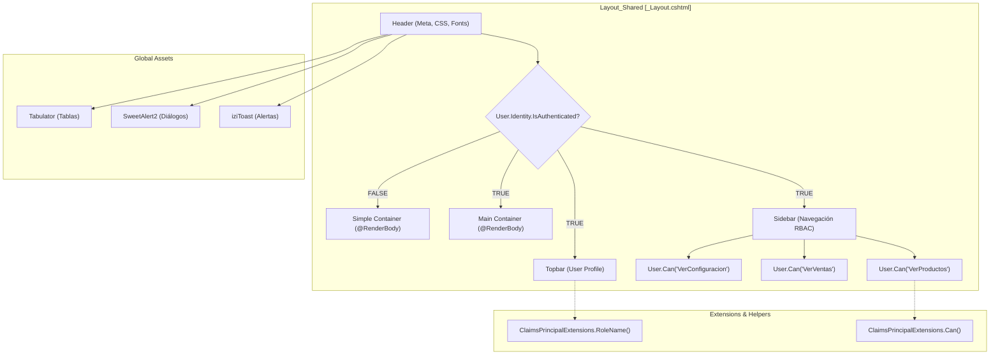
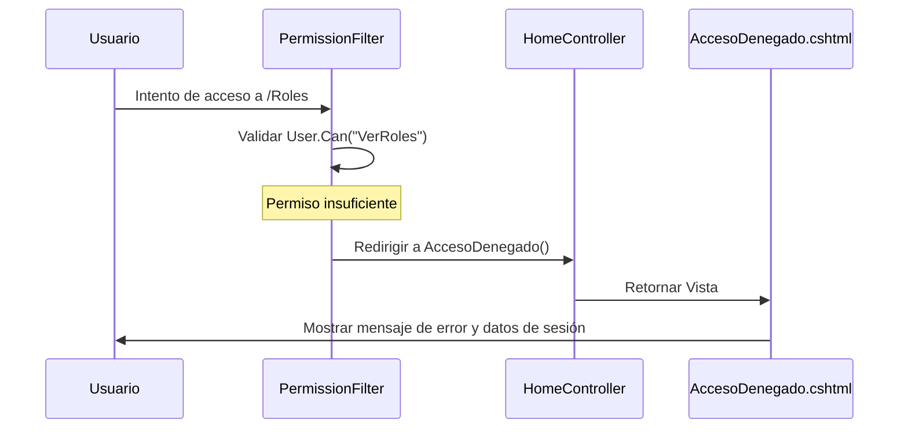

# Layout Compartido y Navegación

# Layout Compartido y Navegación

Relevant source files

The following files were used as context for generating this wiki page:

- [Controllers/HomeController.cs](Controllers/HomeController.cs)
- [Views/Home/AccesoDenegado.cshtml](Views/Home/AccesoDenegado.cshtml)
- [Views/Shared/_Layout.cshtml](Views/Shared/_Layout.cshtml)
- [Views/_ViewImports.cshtml](Views/_ViewImports.cshtml)
- [Views/_ViewStart.cshtml](Views/_ViewStart.cshtml)

Esta sección detalla la implementación de la interfaz de usuario base de la aplicación, centrada en el archivo `_Layout.cshtml`. El sistema utiliza un diseño responsivo con una barra lateral (sidebar) dinámica, un sistema de notificaciones globales y una navegación controlada por el sistema de permisos RBAC (Role-Based Access Control).

## Estructura del Layout Principal

El archivo `_Layout.cshtml` define el esqueleto visual de la aplicación. Utiliza **Tailwind CSS** para el estilizado y una estructura dividida en dos estados principales: autenticado y no autenticado.

### Composición de la Interfaz
Cuando el usuario está autenticado (`User.Identity.IsAuthenticated == true`), el sistema renderiza una estructura de tres componentes principales:

1.  **Sidebar (Barra Lateral):** Contiene el logotipo y el menú de navegación condicional [Views/Shared/_Layout.cshtml:198-316]().
2.  **Topbar (Barra Superior):** Muestra el título de la página actual, la fecha y el perfil del usuario con opción de cierre de sesión [Views/Shared/_Layout.cshtml:322-375]().
3.  **Main Content (Contenido Principal):** El área donde se inyectan las vistas mediante `@RenderBody()` [Views/Shared/_Layout.cshtml:378-382]().

### Diagrama de Estructura de Componentes UI

El siguiente diagrama muestra cómo se organiza el layout y qué entidades de código gestionan cada sección.

Title: Estructura de _Layout.cshtml y Flujo de Navegación

Sources: [Views/Shared/_Layout.cshtml:193-385](), [Views/_ViewImports.cshtml:1-4]()

## Navegación Condicional (RBAC en UI)

La visibilidad de los elementos del menú en la sidebar está estrictamente vinculada a los permisos del usuario logueado mediante el método de extensión `User.Can()`.

### Lógica de Visualización del Menú
El menú se divide en secciones lógicas (General, Inventario, Operaciones, Reportes, Configuración). Cada enlace o grupo de enlaces está envuelto en una comprobación de permisos:

*   **Inventario:** Requiere el permiso `VerProductos` para mostrar el acceso a Productos y Categorías [Views/Shared/_Layout.cshtml:234-245]().
*   **Ventas/POS:** Requiere `VerVentas` [Views/Shared/_Layout.cshtml:257-262]().
*   **Configuración:** Requiere `VerUsuarios` o `VerRoles` para mostrar el menú de administración [Views/Shared/_Layout.cshtml:289-305]().

### Marcado de Enlace Activo
El sistema incluye un script al final del layout que identifica la URL actual y aplica la clase CSS `.active` al enlace correspondiente en la sidebar para proporcionar feedback visual al usuario [Views/Shared/_Layout.cshtml:427-438]().

| Elemento UI | Permiso Requerido | Ruta Destino |
| :--- | :--- | :--- |
| Dashboard | (Autenticado) | `/Home/Index` |
| Productos | `VerProductos` | `/Productos/Index` |
| Punto de Venta | `VerVentas` | `/Ventas/Index` |
| Auditoría | `VerAuditoria` | `/Auditoria/Index` |

Sources: [Views/Shared/_Layout.cshtml:215-316](), [Views/Shared/_Layout.cshtml:427-438]()

## Sistema de Alertas y Notificaciones

La aplicación utiliza un sistema dual para la comunicación con el usuario: **TempData** para mensajes desde el servidor y librerías JavaScript para interacciones en el cliente.

### Notificaciones Globales (iziToast)
El layout escucha las claves de `TempData` en cada carga de página para mostrar notificaciones flotantes:
*   **Success:** Se activa con `TempData["Success"]` [Views/Shared/_Layout.cshtml:398-404]().
*   **Error:** Se activa con `TempData["Error"]` [Views/Shared/_Layout.cshtml:406-412]().

### Configuración de Librerías Externas
El layout centraliza la configuración estética de los componentes de terceros para mantener la coherencia visual:
*   **SweetAlert2:** Utilizado para confirmaciones de eliminación y diálogos de advertencia [Views/Shared/_Layout.cshtml:13]().
*   **Tabulator:** Estilizado mediante CSS personalizado en el layout para coincidir con el tema Indigo/Purple de la aplicación, incluyendo gradientes en los encabezados y efectos hover en las filas [Views/Shared/_Layout.cshtml:56-102]().

### Estilos de Stock Bajo
Se define una clase global `.stock-bajo` que aplica un gradiente rojo y un borde de advertencia, utilizada por los formateadores de Tabulator en diversas vistas para resaltar productos críticos [Views/Shared/_Layout.cshtml:135-141]().

Sources: [Views/Shared/_Layout.cshtml:396-413](), [Views/Shared/_Layout.cshtml:56-92]()

## Gestión de Acceso Denegado

Cuando un usuario intenta acceder a una ruta para la cual no tiene permisos (interceptado por el `PermissionFilter`), el sistema redirige a la acción `AccesoDenegado` del `HomeController`.

### Vista de Acceso Denegado
La vista `AccesoDenegado.cshtml` utiliza el layout compartido pero presenta un diseño de advertencia que incluye:
*   Información del usuario actual (`User.Identity.Name`) y su rol (`User.RoleName()`) [Views/Home/AccesoDenegado.cshtml:21-26]().
*   Opciones rápidas para volver al Dashboard o cerrar sesión [Views/Home/AccesoDenegado.cshtml:30-37]().

Title: Flujo de Redirección por Falta de Permisos

Sources: [Controllers/HomeController.cs:29-33](), [Views/Home/AccesoDenegado.cshtml:1-41]()

---

