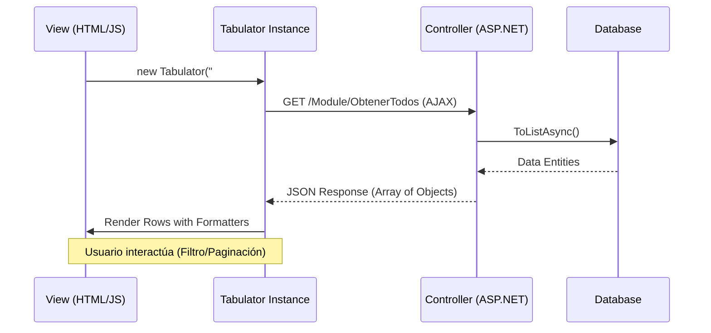
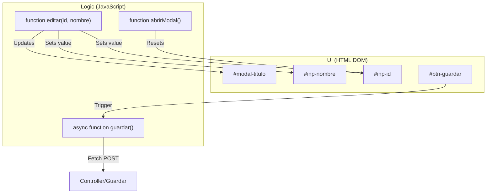

# Patrones de UI: Tablas, Modales y Notificaciones

# Patrones de UI: Tablas, Modales y Notificaciones

Relevant source files

The following files were used as context for generating this wiki page:

- [Views/Categorias/Index.cshtml](Views/Categorias/Index.cshtml)
- [Views/Productos/Index.cshtml](Views/Productos/Index.cshtml)
- [Views/Shared/_ValidationScriptsPartial.cshtml](Views/Shared/_ValidationScriptsPartial.cshtml)
- [Views/Usuarios/Index.cshtml](Views/Usuarios/Index.cshtml)

Esta sección describe los patrones de interfaz de usuario reutilizados en todos los módulos del sistema. El objetivo de estos patrones es proporcionar una experiencia de usuario (UX) coherente, minimizando la recarga de páginas mediante el uso intensivo de AJAX y componentes dinámicos.

## 1. Tablas Dinámicas con Tabulator

El sistema utiliza la librería **Tabulator** para la visualización de datos. A diferencia de las tablas HTML tradicionales, estas permiten paginación local, formateo condicional de celdas y filtrado en tiempo real sin recargar el DOM completo.

### Características Principales
- **Paginación Local**: Los datos se cargan vía AJAX y se gestionan en el cliente para mayor fluidez [Views/Categorias/Index.cshtml:101-102]().
- **Formatters Personalizados**: Se utilizan funciones JavaScript para renderizar badges de colores, iconos y botones de acción dentro de las celdas [Views/Usuarios/Index.cshtml:53-58]().
- **Filtrado Dinámico**: Implementado mediante la función `setFilter` vinculada a inputs de búsqueda [Views/Productos/Index.cshtml:11-12]().

### Flujo de Datos en Tablas
El siguiente diagrama muestra cómo los componentes de la vista interactúan con el controlador para poblar la tabla.

**Diagrama: Ciclo de Vida de una Tabla Tabulator**

**Fuentes:** [Views/Categorias/Index.cshtml:97-118](), [Views/Usuarios/Index.cshtml:40-72]().

---

## 2. Modales CRUD y Animaciones

Para las operaciones de creación y edición (Create/Update), el sistema emplea modales personalizados construidos con **Tailwind CSS**. Estos evitan que el usuario pierda el contexto de la lista principal.

### Implementación Técnica
- **Estructura**: Un contenedor `modal-overlay` con fondo desenfocado (`backdrop-blur`) y un `modal-content` con animaciones CSS [Views/Productos/Index.cshtml:61-62]().
- **Gestión de Estado**: Se utiliza un campo oculto `inp-id` para diferenciar entre creación (ID=0) y edición (ID > 0) [Views/Categorias/Index.cshtml:76]().
- **Limpieza**: La función `cerrarModal()` resetea los campos y oculta los mensajes de error para garantizar un estado limpio en la siguiente apertura [Views/Categorias/Index.cshtml:138-143]().

### Asociación de Entidades de Código
Este diagrama vincula los elementos visuales del modal con las variables y funciones en el código.

**Diagrama: Mapeo de UI a Lógica JavaScript**

**Fuentes:** [Views/Categorias/Index.cshtml:39-92](), [Views/Productos/Index.cshtml:61-125]().

---

## 3. Notificaciones y Diálogos de Confirmación

El sistema estandariza la comunicación con el usuario mediante dos librerías principales: **iziToast** para notificaciones no intrusivas y **SweetAlert2 (Swal2)** para confirmaciones críticas.

### Patrones de Notificación
1.  **Toasts (iziToast)**: Se disparan tras el éxito o fallo de una operación AJAX. 
    - Ejemplo: `Toast.success('Éxito', 'Registro guardado')` [Views/Usuarios/Index.cshtml:86]().
2.  **Diálogos (SweetAlert2)**: Utilizados exclusivamente para confirmar eliminaciones.
    - Implementación: Se encapsula en una llamada `await Swal2.delete(...)` que retorna una promesa [Views/Usuarios/Index.cshtml:75-76]().

### Validación de Cliente
Además de las validaciones de servidor, se utilizan mensajes de error en tiempo real (clase `text-red-500`) que se activan si los campos obligatorios están vacíos antes de enviar la solicitud al servidor [Views/Categorias/Index.cshtml:61-66]().

| Tipo de Acción | Componente UI | Disparador (Trigger) |
| :--- | :--- | :--- |
| Confirmación de Borrado | SweetAlert2 | Botón Eliminar en tabla |
| Éxito en Guardado | iziToast (Success) | Respuesta JSON `ok: true` |
| Error de Validación | DOM (`#err-nombre`) | Función `guardar()` |
| Stock Crítico | Alert Panel | Carga de página (Productos) |

**Fuentes:** [Views/Usuarios/Index.cshtml:74-88](), [Views/Categorias/Index.cshtml:145-165](), [Views/Productos/Index.cshtml:32-42]().

---

## 4. Estilos y Animaciones CSS

El sistema utiliza clases utilitarias de Tailwind CSS junto con animaciones personalizadas definidas en el layout global para mejorar la interactividad:

- **`fade-in-up`**: Aplicada a los contenedores principales para una entrada suave de los módulos [Views/Usuarios/Index.cshtml:5]().
- **`pulse-alert`**: Aplicada a las alertas de stock bajo para captar la atención del usuario [Views/Productos/Index.cshtml:32]().
- **`card-hover`**: Efecto de elevación sutil en los contenedores de las tablas [Views/Categorias/Index.cshtml:21]().

**Fuentes:** [Views/Productos/Index.cshtml:32-45](), [Views/Usuarios/Index.cshtml:5]().

---

