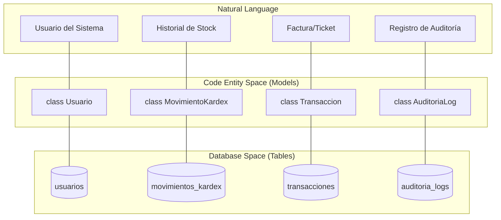
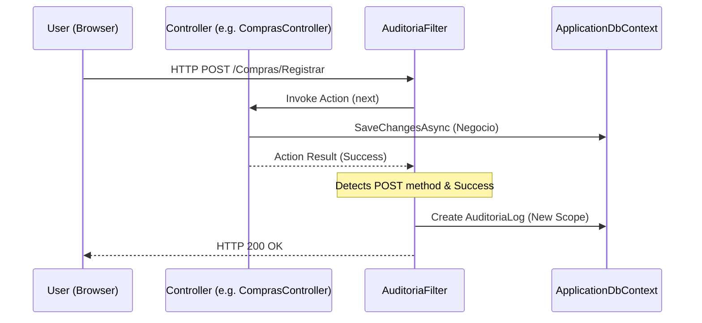

# Glosario de Términos y Conceptos Clave

# Glosario de Términos y Conceptos Clave

Relevant source files

The following files were used as context for generating this wiki page:

- [Authorization/RequirePermissionAttribute.cs](Authorization/RequirePermissionAttribute.cs)
- [Controllers/ComprasController.cs](Controllers/ComprasController.cs)
- [Controllers/RolesController.cs](Controllers/RolesController.cs)
- [Controllers/VentasController.cs](Controllers/VentasController.cs)
- [Data/ApplicationDbContext.cs](Data/ApplicationDbContext.cs)
- [Extensions/ClaimsPrincipalExtensions.cs](Extensions/ClaimsPrincipalExtensions.cs)
- [Filters/AuditoriaFilter.cs](Filters/AuditoriaFilter.cs)
- [Models/AuditoriaLog.cs](Models/AuditoriaLog.cs)
- [Models/MovimientoKardex.cs](Models/MovimientoKardex.cs)
- [Models/Pago.cs](Models/Pago.cs)
- [Models/Transaccion.cs](Models/Transaccion.cs)
- [Models/Usuario.cs](Models/Usuario.cs)
- [Program.cs](Program.cs)
- [inventario.sql](inventario.sql)

Esta página proporciona definiciones técnicas y conceptuales de los componentes del sistema **InventarioApp**. Su objetivo es servir como referencia rápida para nuevos desarrolladores, vinculando la terminología de negocio con las entidades de código y la base de datos.

## Conceptos de Dominio y Negocio

### Transacción (Unificada)
En este sistema, una "Transacción" es un concepto sombrilla que abarca tanto **Compras** como **Ventas**. En lugar de tener tablas de cabecera separadas, se utiliza una única entidad `Transaccion` [Models/Transaccion.cs:31-32]() diferenciada por un discriminador de tipo.

*   **TipoTransaccion**: Enumeración que define si el registro es una `Compra` o una `Venta` [Models/Transaccion.cs:9-13]().
*   **EstadoPagoTransaccion**: Define el ciclo de vida financiero de la transacción (`Pendiente`, `Parcial`, `Pagado`) [Models/Transaccion.cs:15-20]().

### Kárdex
El Kárdex es el registro histórico detallado de todos los movimientos de inventario de un producto. Cada vez que el stock físico cambia (ya sea por compra, venta o ajuste manual), se genera un `MovimientoKardex` [Models/MovimientoKardex.cs:16-17]().

*   **Saldo Resultante**: A diferencia de un simple log, el Kárdex guarda el `Saldo` [Models/MovimientoKardex.cs:47]() (stock total) en el momento exacto del movimiento, permitiendo reconstruir el inventario en cualquier fecha pasada.

### POS (Point of Sale)
Referido en el código como el terminal de ventas. El `VentasController` [Controllers/VentasController.cs:15]() maneja esta lógica, asumiendo por defecto que las transacciones son de contado (`EstadoPagoTransaccion.Pagado`) [Controllers/VentasController.cs:140]().

---

## Mapeo de Conceptos a Entidades de Código

El siguiente diagrama asocia los términos del lenguaje natural con las clases de C# y las tablas de la base de datos MySQL definidas en `ApplicationDbContext` [Data/ApplicationDbContext.cs:12]().

### Diagrama: Espacio de Nombres a Entidades de Datos

**Sources:** [Models/Usuario.cs:9-10](), [Models/MovimientoKardex.cs:15-16](), [Models/Transaccion.cs:30-31](), [Models/AuditoriaLog.cs:9-10](), [Data/ApplicationDbContext.cs:18-36]()

---

## Términos Técnicos y Abreviaturas

| Término | Definición Técnica | Referencia en Código |
| :--- | :--- | :--- |
| **RBAC** | *Role-Based Access Control*. Sistema de permisos basado en roles asignados a usuarios. | [Controllers/RolesController.cs]() |
| **Claim** | Declaración de identidad o permiso adjunta al ticket de autenticación del usuario. | [Authorization/PermissionFilter.cs:57]() |
| **Bypass de Admin** | Lógica que permite al rol "Administrador" omitir las validaciones de permisos específicos. | [Authorization/PermissionFilter.cs:53-54]() |
| **DTO** | *Data Transfer Object*. Objetos simples usados para mover datos entre el cliente (JSON) y el servidor. | [Controllers/VentasController.cs:193-196]() |
| **Snake_case** | Convención de nombres usada en la base de datos (ej. `usuario_id`) mapeada mediante `[Column]`. | [Models/Usuario.cs:38]() |
| **Fluent API** | Método de configuración de EF Core usado para definir relaciones complejas en el `OnModelCreating`. | [Data/ApplicationDbContext.cs:38-40]() |

---

## Flujo de Seguridad y Auditoría

El sistema implementa un rastreo automático de acciones críticas mediante un filtro global.

### Diagrama: Intercepción de Acciones (AuditoriaFilter)

Este diagrama muestra cómo el `AuditoriaFilter` [Filters/AuditoriaFilter.cs:16]() interactúa con las peticiones HTTP para persistir logs sin bloquear la lógica de negocio.

**Sources:** [Filters/AuditoriaFilter.cs:28-33](), [Filters/AuditoriaFilter.cs:59-62](), [Program.cs:31]()

---

## Definiciones de Entidades Específicas

### Usuario e Identidad
*   **UserName**: Identificador único para el inicio de sesión [Models/Usuario.cs:25](). Tiene un índice único en la base de datos `uk_usuarios_username` [Data/ApplicationDbContext.cs:51]().
*   **RolId**: Clave foránea que vincula al usuario con un `Rol` [Models/Usuario.cs:40](). Si se elimina el rol, este campo se establece en `NULL` [Data/ApplicationDbContext.cs:89]().

### Transacciones y Detalles
*   **DetalleCompra**: Almacena el `PrecioCosto` y el `MontoImpuesto` calculado al momento de la entrada [Models/DetalleCompraDto.cs:162]().
*   **DetalleVenta**: Almacena el `PrecioVenta` aplicado en el POS [Models/DetalleVentaDto.cs:202]().
*   **SaldoPendiente**: Campo en `Transaccion` que rastrea cuánto dinero falta por pagar/cobrar. Se inicializa con el `Total` en compras [Controllers/ComprasController.cs:127]() y disminuye mediante registros en la tabla `Pagos` [Models/Pago.cs:9]().

### Impuestos
*   **Impuesto**: Entidad que define un nombre (ej. "IVA") y un porcentaje (ej. 19.00) [inventario.sql:127-130](). Los productos tienen una relación opcional con un impuesto [Data/ApplicationDbContext.cs:65]().

---
**Sources:**
* [Data/ApplicationDbContext.cs:1-116]()
* [Models/Transaccion.cs:1-84]()
* [Models/Usuario.cs:1-44]()
* [Filters/AuditoriaFilter.cs:1-82]()
* [Authorization/RequirePermissionAttribute.cs:1-62]()
* [Controllers/VentasController.cs:1-204]()
* [Controllers/ComprasController.cs:1-164]()
* [inventario.sql:1-132]()